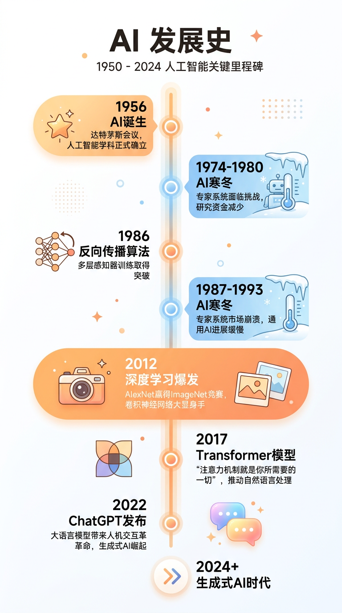
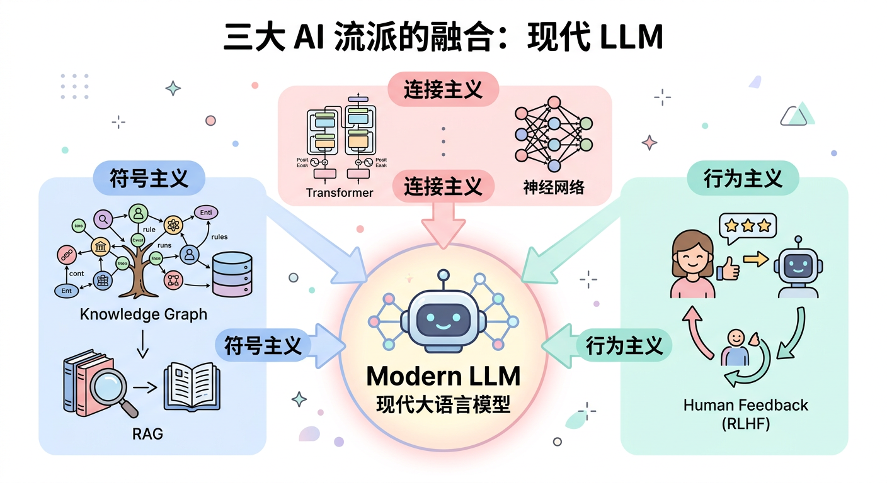
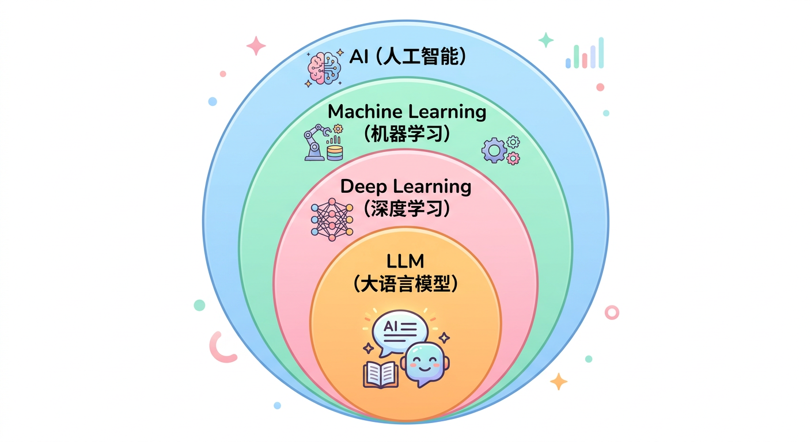
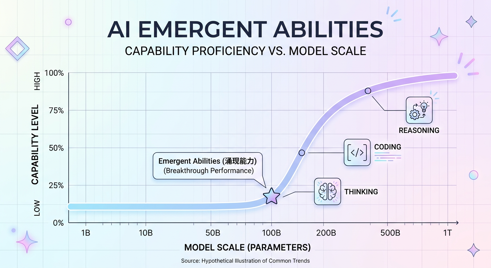
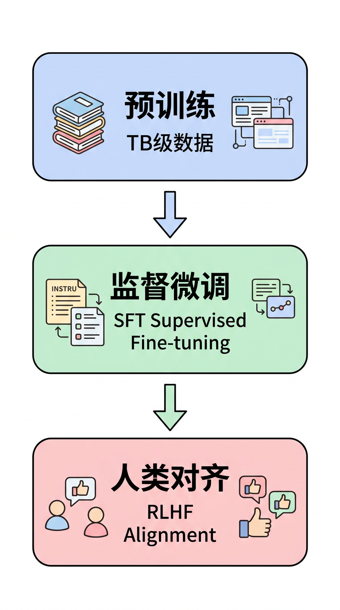

# 第一章：AI基础与发展脉络

## 学习目标

完成本章学习后，你将能够：
- 清晰描述人工智能70年发展历程中的关键里程碑
- 理解符号主义、连接主义、行为主义三大学派的核心思想
- 准确区分机器学习、深度学习、大模型的概念边界
- 掌握大模型时代的核心技术突破（Scaling Law、涌现能力、ICL）

---

## 1.1 人工智能的定义

### 什么是人工智能？

**人工智能（Artificial Intelligence, AI）** 是研究如何让计算机模拟人类智能行为的学科。

> **通俗理解**：让机器能够"看"（计算机视觉）、"听"（语音识别）、"说"（语音合成）、"读"（自然语言理解）、"写"（文本生成）、"想"（推理决策）。

### 图灵测试

1950年，艾伦·图灵在论文《计算机器与智能》中提出了著名的**图灵测试**：

```
如果一台机器能够与人类进行对话，
而人类无法分辨对方是机器还是人，
那么这台机器就具有智能。
```

> **思考**：ChatGPT能通过图灵测试吗？严格来说，现代大模型在特定场景下已经能够"欺骗"人类，但这是否意味着它们真正具有智能，仍是哲学和科学界争论的话题。

---

## 1.2 人工智能发展史：三次浪潮与两次寒冬

### 发展时间线



### 第一次浪潮（1956-1974）：符号主义的黄金时代

#### 达特茅斯会议（1956）

这是AI历史上最重要的事件。John McCarthy、Marvin Minsky、Claude Shannon等科学家齐聚达特茅斯学院，正式提出"Artificial Intelligence"这个术语。

**会议的核心假设**：
> "学习的每个方面或智能的任何其他特征，原则上都可以被精确描述，从而可以制造一台机器来模拟它。"

#### 早期成果

| 系统名称 | 年份 | 功能描述 | 意义 |
|---------|------|---------|------|
| Logic Theorist | 1956 | 自动证明数学定理 | 第一个AI程序 |
| GPS | 1959 | 通用问题求解器 | 模拟人类思维 |
| ELIZA | 1966 | 模拟心理治疗师对话 | 最早的聊天机器人 |

#### 第一次AI寒冬的原因

1. **计算能力瓶颈**：当时最快的计算机也无法处理复杂问题
2. **组合爆炸**：搜索空间随问题规模指数级增长
3. **感知机局限**：1969年Minsky证明单层感知机无法解决XOR问题
4. **过度承诺**：早期研究者对AI的预期过于乐观

### 第二次浪潮（1980-1995）：专家系统的兴衰

#### 专家系统

专家系统是将人类专家的知识编码为"如果-那么"规则的系统。

**著名案例**：
- **MYCIN**（医疗）：诊断细菌感染，准确率超过人类专家
- **XCON/R1**（商业）：为DEC公司配置计算机，每年节省4000万美元

#### 反向传播算法的复兴

1986年，Rumelhart等人重新发现并推广了**反向传播（Backpropagation）算法**，使得训练多层神经网络成为可能。

```
反向传播的核心思想：
1. 前向传播：输入 → 隐藏层 → 输出
2. 计算误差：比较输出与真实值
3. 反向传播：将误差从输出层逐层传回
4. 更新权重：根据误差调整每层的参数
```

#### 第二次AI寒冬的原因

1. **知识获取瓶颈**：专家系统需要人工编码知识，成本极高
2. **系统脆弱**：无法处理规则未覆盖的情况
3. **神经网络局限**：计算能力和数据不足以训练深层网络

### 第三次浪潮（2006-至今）：深度学习革命

#### 2006年：深度学习的起点

Geoffrey Hinton提出**深度信念网络（DBN）**，通过逐层预训练解决深层网络难以训练的问题。

#### 2012年：AlexNet的历史性突破

AlexNet在ImageNet图像分类比赛中将错误率从26%降至15%，领先第二名10个百分点以上。

**AlexNet的关键创新**：

| 创新点 | 作用 |
|-------|------|
| ReLU激活函数 | 缓解梯度消失问题 |
| Dropout | 防止过拟合 |
| GPU训练 | 大幅加速计算 |
| 数据增强 | 扩充训练数据 |

> **为什么是2012年？**
> 三个关键因素同时成熟：
> 1. **数据**：ImageNet提供1400万张标注图片
> 2. **算力**：GPU的并行计算能力
> 3. **算法**：ReLU、Dropout等技术突破

#### 2017年：Transformer改变一切

Google发布论文《Attention Is All You Need》，提出Transformer架构，彻底改变了NLP领域。

**Transformer vs RNN**：

| 维度 | RNN | Transformer |
|-----|-----|-------------|
| 计算方式 | 串行（必须按顺序处理） | 并行（可同时处理所有位置） |
| 长距离依赖 | 困难（信息逐步衰减） | 容易（直接建模任意位置关系） |
| 训练效率 | 慢 | 快 |
| 可扩展性 | 差 | 好（奠定大模型基础） |

#### 2020年至今：大模型时代

| 时间 | 模型 | 参数量 | 里程碑意义 |
|-----|------|-------|-----------|
| 2020.06 | GPT-3 | 1750亿 | 涌现能力首次显现 |
| 2022.11 | ChatGPT | - | AI走向大众 |
| 2023.03 | GPT-4 | ~1万亿(推测) | 多模态能力 |
| 2023.12 | Gemini | - | Google多模态大模型 |

---

## 1.3 三大学派

人工智能研究主要有三大流派，各有不同的哲学基础和技术路线：

### 符号主义（Symbolicism）

**核心思想**：智能可以通过符号操作和逻辑推理实现。

**理论基础**：
- 物理符号系统假说（Newell & Simon）
- 知识可以用符号明确表示
- 推理就是符号的变换

**代表技术**：
```
• 专家系统：将人类知识编码为规则
• 知识图谱：用图结构表示实体和关系
• 逻辑编程：Prolog语言
• 语义网络：概念之间的关系网络
```

**优势与局限**：

| 优势 | 局限 |
|-----|------|
| 可解释性强 | 知识获取困难 |
| 推理过程透明 | 难以处理不确定性 |
| 适合规则明确的领域 | 缺乏学习能力 |

### 连接主义（Connectionism）

**核心思想**：智能来自大量简单单元的连接和协作（模拟大脑神经元）。

**理论基础**：
- 神经网络模型
- 分布式表示
- 从数据中学习

**代表技术**：
```
• 感知机、多层感知机（MLP）
• 卷积神经网络（CNN）
• 循环神经网络（RNN/LSTM）
• Transformer / 大语言模型
```

**优势与局限**：

| 优势 | 局限 |
|-----|------|
| 强大的学习能力 | 黑盒模型，难以解释 |
| 自动特征提取 | 需要大量数据 |
| 处理非结构化数据 | 计算资源消耗大 |

### 行为主义（Behaviorism）

**核心思想**：智能体通过与环境交互、获得反馈来学习行为。

**理论基础**：
- 强化学习理论
- 试错学习
- 奖励信号驱动

**代表技术**：
```
• Q-Learning
• 深度强化学习（DQN、A3C）
• 策略梯度方法（PPO）
• RLHF（人类反馈强化学习）
```

**优势与局限**：

| 优势 | 局限 |
|-----|------|
| 自主决策能力 | 样本效率低 |
| 适合序列决策 | 奖励函数设计困难 |
| 从反馈中持续改进 | 训练不稳定 |

### 三大学派的融合

现代大模型实际上融合了三大学派的思想：



---

## 1.4 机器学习、深度学习与大模型的关系

### 概念层级



### 详细对比

| 维度 | 传统机器学习 | 深度学习 | 大语言模型 |
|-----|-------------|---------|-----------|
| **代表算法** | SVM、决策树、随机森林 | CNN、RNN、LSTM | GPT、BERT、LLaMA |
| **特征工程** | 人工设计特征 | 自动学习特征 | 自动学习特征 |
| **数据需求** | 千~万级样本 | 万~百万级样本 | TB级文本数据 |
| **参数规模** | 千~百万 | 百万~十亿 | 十亿~万亿 |
| **模型深度** | 浅层（1-2层） | 深层（几十~上百层） | 超深（数十~上百层） |
| **任务范式** | 单一任务 | 单一/多任务 | 通用任务（一个模型处理多种任务） |
| **可解释性** | 较好 | 较差 | 差 |
| **典型应用** | 信用评分、推荐 | 图像识别、语音识别 | 对话、写作、编程、推理 |

### 机器学习的分类

```
机器学习
│
├── 监督学习 (Supervised Learning)
│   │  有标签数据，学习输入到输出的映射
│   ├── 分类：垃圾邮件识别、图像分类
│   └── 回归：房价预测、销量预测
│
├── 无监督学习 (Unsupervised Learning)
│   │  无标签数据，发现数据内在结构
│   ├── 聚类：用户分群、文档聚类
│   └── 降维：PCA、t-SNE可视化
│
├── 自监督学习 (Self-supervised Learning)
│   │  从数据本身构造监督信号
│   ├── 语言模型预训练（预测下一个词）
│   └── 对比学习（区分正负样本）
│
└── 强化学习 (Reinforcement Learning)
    │  通过与环境交互获得奖励信号
    ├── 游戏AI：AlphaGo、Atari
    └── 机器人控制、推荐系统
```

---

## 1.5 大模型时代的关键突破

### Scaling Law（规模定律）

#### 什么是Scaling Law？

2020年，OpenAI发现了一个重要规律：**模型性能与规模（参数量、数据量、计算量）呈幂律关系**。

```
损失函数 L ∝ N^(-α) + D^(-β) + C^(-γ)

其中：
• N = 模型参数量
• D = 训练数据量
• C = 计算量（FLOPs）
• α, β, γ ≈ 0.05-0.1（幂律指数）
```

**通俗理解**：模型越大、数据越多、算力越强，效果越好。

#### Chinchilla定律（2022）

DeepMind进一步发现，在固定计算预算下，**参数量和数据量应该同比例扩展**。

| 模型 | 参数量 | 训练Token数 | 参数:数据比 |
|-----|-------|------------|------------|
| GPT-3 | 175B | 300B | 1:1.7 |
| Chinchilla | 70B | 1.4T | 1:20 |
| LLaMA-2 | 70B | 2T | 1:29 |

**结论**：之前的模型普遍"欠训练"（参数多但数据少），应该用更多数据训练相对小的模型。

### 涌现能力（Emergent Abilities）

#### 什么是涌现能力？

**涌现能力**是指：在小模型中完全不存在，但当模型规模超过某个临界点后突然出现的能力。



#### 代表性涌现能力

| 能力 | 描述 | 临界规模 |
|-----|------|---------|
| **思维链推理（CoT）** | 分步骤解决复杂问题 | ~100B |
| **零样本学习** | 无需示例即可完成新任务 | ~10B |
| **少样本学习** | 通过几个例子学习新任务 | ~1B |
| **指令遵循** | 理解并执行自然语言指令 | ~10B |
| **代码生成** | 根据自然语言生成代码 | ~10B |
| **复杂推理** | 数学推理、逻辑推理 | ~100B |

> **争议**：最新研究表明，涌现可能是评估指标的假象——使用连续指标时，能力增长是平滑的，而非突变。

### In-Context Learning（上下文学习）

#### 什么是上下文学习？

**上下文学习（ICL）** 是指模型仅通过阅读输入中的示例，就能学会执行新任务，**无需更新任何参数**。

这是大模型最神奇的能力之一。

#### 学习范式对比

| 范式 | 是否更新参数 | 示例数量 | 计算成本 |
|-----|------------|---------|---------|
| Zero-shot | 否 | 0 | 最低 |
| One-shot | 否 | 1 | 低 |
| Few-shot | 否 | 2-32 | 低 |
| Fine-tuning | 是 | 数千~数万 | 高 |

#### Few-shot示例

```
任务：将中文翻译成英文

示例1：
中文：今天天气很好
英文：The weather is nice today

示例2：
中文：我喜欢吃苹果
英文：I like eating apples

请翻译：
中文：机器学习很有趣
英文：
```

模型输出：`Machine learning is very interesting`

> **为什么ICL有效？** 这仍是开放问题。一种解释是：预训练阶段模型已经学会了"学习如何学习"的元能力。

### 预训练-微调范式

现代大模型的训练通常分为三个阶段：



**三阶段详解：**

| 阶段 | 数据 | 目标 | 产出 |
|-----|------|------|------|
| **预训练** | TB级无标注文本 | 预测下一个词 | 基础模型 |
| **监督微调(SFT)** | 万级指令-回复对 | 遵循人类指令 | 指令模型 |
| **人类对齐** | 人类偏好标注 | 安全、有用、诚实 | 助手模型 |

---

## 1.6 本章小结

### 核心要点回顾

1. **AI发展史**：经历三次浪潮、两次寒冬，2012年深度学习爆发，2017年Transformer开启大模型时代

2. **三大学派**：
   - 符号主义：知识+推理
   - 连接主义：神经网络+学习
   - 行为主义：交互+反馈

3. **概念层级**：AI > 机器学习 > 深度学习 > 大模型

4. **大模型突破**：
   - Scaling Law：规模带来性能
   - 涌现能力：量变引起质变
   - ICL：无需微调的学习

### 一句话总结

> **大模型的本质创新**：通过在海量数据上自监督预训练，将知识压缩进参数，实现"一个模型处理万种任务"的通用人工智能范式。

---

## 延伸阅读

### 必读论文

1. **Attention Is All You Need** (2017)
   - Transformer架构原文
   - [arxiv.org/abs/1706.03762](https://arxiv.org/abs/1706.03762)

2. **Language Models are Few-Shot Learners** (2020)
   - GPT-3论文，首次展示涌现能力
   - [arxiv.org/abs/2005.14165](https://arxiv.org/abs/2005.14165)

3. **Scaling Laws for Neural Language Models** (2020)
   - Scaling Law原文
   - [arxiv.org/abs/2001.08361](https://arxiv.org/abs/2001.08361)

4. **Training Compute-Optimal Large Language Models** (2022)
   - Chinchilla论文
   - [arxiv.org/abs/2203.15556](https://arxiv.org/abs/2203.15556)

### 推荐资源

- [Andrej Karpathy: Intro to Large Language Models](https://www.youtube.com/watch?v=zjkBMFhNj_g)
- [Jay Alammar: The Illustrated Transformer](http://jalammar.github.io/illustrated-transformer/)
- [Lilian Weng's Blog](https://lilianweng.github.io/)

---

下一章：[第二章：深度学习核心原理](../第二章_深度学习核心原理/README.md)
