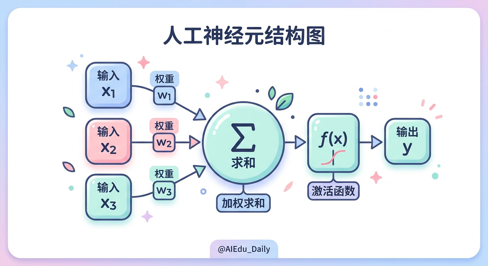
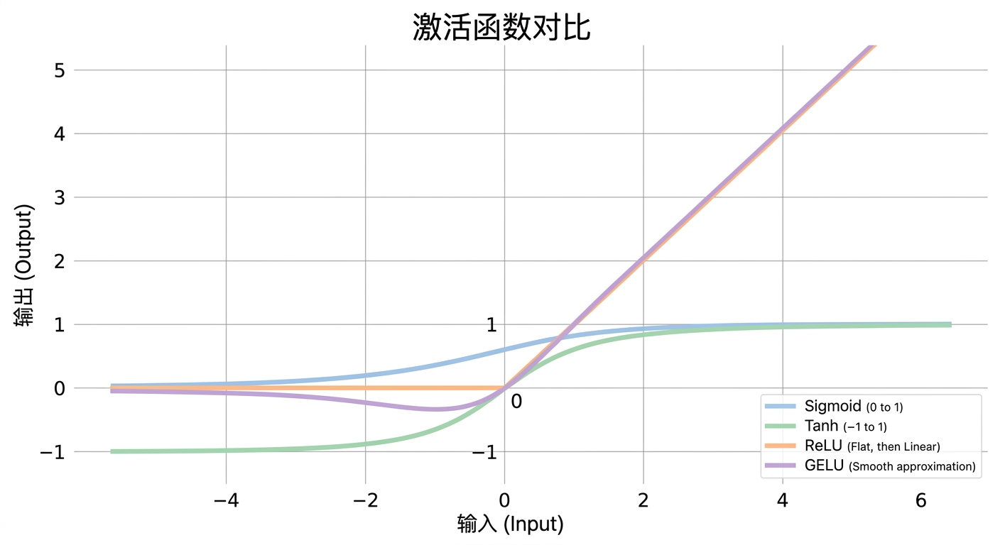
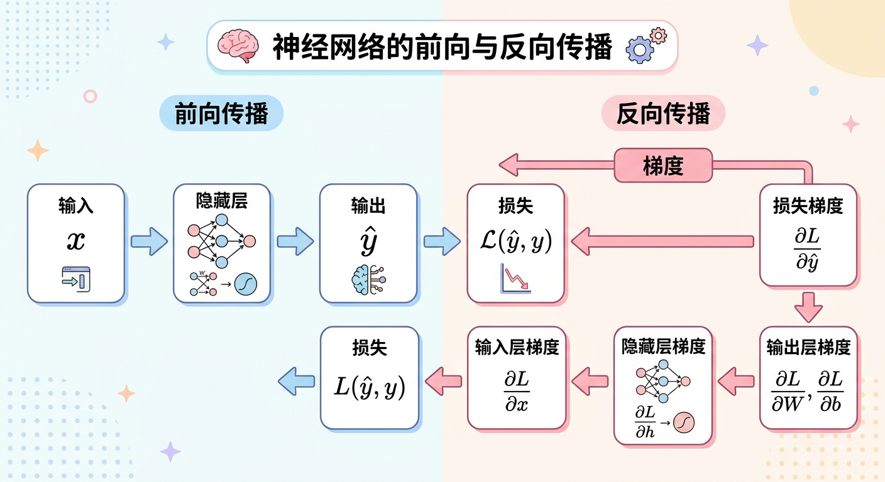
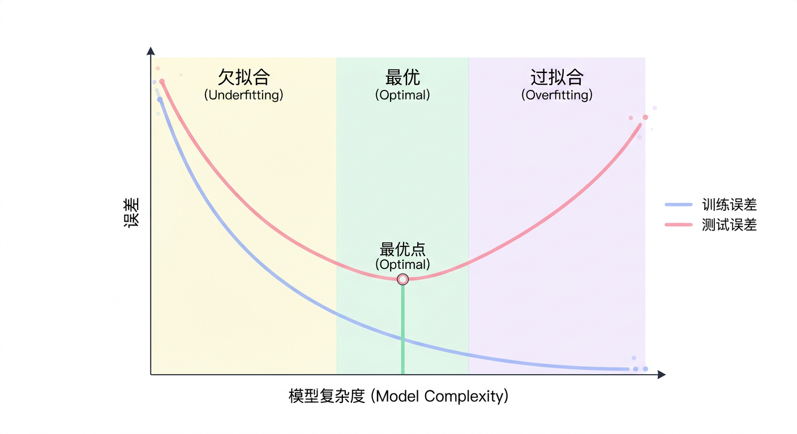

# 第二章：深度学习核心原理

## 学习目标

完成本章学习后，你将能够：
- 理解神经网络的基本结构和工作原理
- 掌握前向传播与反向传播的数学推导
- 熟悉各类激活函数的特点和选择依据
- 理解梯度下降及其变体优化算法
- 掌握正则化技术防止过拟合的原理

---

## 2.1 神经网络基础

### 从生物神经元到人工神经元

**生物神经元**由树突（接收信号）、细胞体（处理信号）、轴突（传递信号）组成。当输入信号的总和超过阈值时，神经元被激活并向下游传递信号。

**人工神经元**模拟了这一过程：



数学表达：
```
y = f(Σᵢ wᵢxᵢ + b) = f(w·x + b)

其中：
- x: 输入向量
- w: 权重向量
- b: 偏置（bias）
- f: 激活函数
- y: 输出
```

### 感知机（Perceptron）

感知机是最简单的神经网络，由Frank Rosenblatt于1958年提出。

**结构**：单层神经元，输出为0或1

```python
# 感知机的计算
def perceptron(x, w, b):
    z = np.dot(w, x) + b
    return 1 if z > 0 else 0
```

**局限性**：感知机只能解决**线性可分**问题。1969年Minsky证明单层感知机无法解决XOR问题，这直接导致了第一次AI寒冬。

### 多层感知机（MLP）

通过堆叠多层神经元，可以解决非线性问题。

**通用近似定理**：一个具有足够多神经元的单隐藏层MLP，可以以任意精度逼近任何连续函数。

> **通俗理解**：足够宽的神经网络理论上可以学习任何函数，但实际中深层网络通常比宽而浅的网络更高效。

---

## 2.2 激活函数

激活函数为神经网络引入**非线性**，使其能够学习复杂的模式。

### 常用激活函数对比

| 函数 | 公式 | 值域 | 优点 | 缺点 |
|-----|------|-----|------|------|
| Sigmoid | σ(x) = 1/(1+e⁻ˣ) | (0,1) | 输出可解释为概率 | 梯度消失、非零中心 |
| Tanh | tanh(x) = (eˣ-e⁻ˣ)/(eˣ+e⁻ˣ) | (-1,1) | 零中心化 | 梯度消失 |
| ReLU | max(0,x) | [0,+∞) | 计算简单、缓解梯度消失 | Dead ReLU问题 |
| Leaky ReLU | max(αx,x), α=0.01 | (-∞,+∞) | 解决Dead ReLU | 需要调参 |
| GELU | x·Φ(x) | - | 平滑、性能好 | 计算稍复杂 |
| SiLU/Swish | x·σ(x) | - | 平滑、自门控 | 计算稍复杂 |

### Sigmoid函数

```
σ(x) = 1 / (1 + e⁻ˣ)

导数：σ'(x) = σ(x)(1 - σ(x))
```

**问题**：
1. **梯度消失**：当x很大或很小时，导数接近0
2. **非零中心**：输出恒为正，影响梯度更新方向
3. **指数运算**：计算成本较高

### ReLU函数

```
ReLU(x) = max(0, x)

导数：ReLU'(x) = 1 if x > 0 else 0
```

**优点**：
- 计算简单高效
- 缓解梯度消失（正区间导数恒为1）
- 产生稀疏激活

**Dead ReLU问题**：如果输入恒为负，神经元永远不会被激活，梯度为0，无法更新。

**解决方案**：Leaky ReLU、PReLU、ELU

### GELU函数（大模型常用）

```
GELU(x) = x · Φ(x) ≈ 0.5x(1 + tanh(√(2/π)(x + 0.044715x³)))

其中Φ(x)是标准正态分布的累积分布函数
```

**特点**：
- 平滑、可导（不像ReLU在0处不可导）
- 引入随机性的思想（概率性激活）
- GPT、BERT等大模型的标准选择

### 激活函数选择指南



**如何选择激活函数？**

| 场景 | 推荐激活函数 |
|-----|------------|
| **隐藏层默认** | ReLU及其变体 |
| **大模型/Transformer** | GELU或SiLU |
| **RNN** | Tanh |
| **二分类输出** | Sigmoid |
| **多分类输出** | Softmax |
| **回归输出** | 无激活函数（线性） |

---

## 2.3 前向传播

前向传播是输入数据通过网络计算输出的过程。

### 单层计算

```
输入：x ∈ ℝⁿ
权重：W ∈ ℝᵐˣⁿ
偏置：b ∈ ℝᵐ
激活：f

输出：a = f(Wx + b) = f(z)
```

### 多层网络的前向传播

```
第1层：z⁽¹⁾ = W⁽¹⁾x + b⁽¹⁾,    a⁽¹⁾ = f(z⁽¹⁾)
第2层：z⁽²⁾ = W⁽²⁾a⁽¹⁾ + b⁽²⁾,  a⁽²⁾ = f(z⁽²⁾)
...
第L层：z⁽ᴸ⁾ = W⁽ᴸ⁾a⁽ᴸ⁻¹⁾ + b⁽ᴸ⁾, ŷ = a⁽ᴸ⁾ = f(z⁽ᴸ⁾)
```

### 代码示例

```python
def forward(x, weights, biases, activation):
    """多层前向传播"""
    a = x
    for W, b in zip(weights, biases):
        z = np.dot(W, a) + b
        a = activation(z)
    return a
```

---

## 2.4 损失函数

损失函数衡量模型预测与真实值之间的差距。

### 常用损失函数

| 损失函数 | 公式 | 适用场景 |
|---------|------|---------|
| MSE | L = (1/n)Σ(y - ŷ)² | 回归问题 |
| MAE | L = (1/n)Σ\|y - ŷ\| | 回归（对异常值鲁棒） |
| Cross-Entropy | L = -Σy·log(ŷ) | 分类问题 |
| Binary CE | L = -[y·log(ŷ) + (1-y)·log(1-ŷ)] | 二分类 |

### 交叉熵损失详解

**二分类交叉熵**：

```
L = -[y·log(ŷ) + (1-y)·log(1-ŷ)]

当y=1时：L = -log(ŷ)     → 预测越接近1，损失越小
当y=0时：L = -log(1-ŷ)   → 预测越接近0，损失越小
```

**多分类交叉熵**（配合Softmax）：

```
Softmax: ŷᵢ = exp(zᵢ) / Σⱼexp(zⱼ)

Cross-Entropy: L = -Σᵢ yᵢ·log(ŷᵢ)
```

> **为什么分类用交叉熵而不用MSE？**
> 1. 交叉熵的梯度更大，训练更快
> 2. 交叉熵与Softmax配合，梯度计算简洁
> 3. 信息论角度：交叉熵衡量两个分布的差异

---

## 2.5 反向传播

反向传播（Backpropagation）是训练神经网络的核心算法，利用链式法则计算损失对每个参数的梯度。

### 链式法则

```
如果 y = f(g(x))，则 dy/dx = (dy/dg) · (dg/dx)
```

### 反向传播推导

以单隐藏层网络为例：

```
前向：x → z⁽¹⁾ = W⁽¹⁾x + b⁽¹⁾ → a⁽¹⁾ = σ(z⁽¹⁾) → z⁽²⁾ = W⁽²⁾a⁽¹⁾ + b⁽²⁾ → ŷ = σ(z⁽²⁾) → L

反向：
∂L/∂ŷ        # 损失对输出的梯度
∂L/∂z⁽²⁾ = ∂L/∂ŷ · ∂ŷ/∂z⁽²⁾ = ∂L/∂ŷ · σ'(z⁽²⁾)
∂L/∂W⁽²⁾ = ∂L/∂z⁽²⁾ · a⁽¹⁾ᵀ
∂L/∂b⁽²⁾ = ∂L/∂z⁽²⁾
∂L/∂a⁽¹⁾ = W⁽²⁾ᵀ · ∂L/∂z⁽²⁾
∂L/∂z⁽¹⁾ = ∂L/∂a⁽¹⁾ · σ'(z⁽¹⁾)
∂L/∂W⁽¹⁾ = ∂L/∂z⁽¹⁾ · xᵀ
∂L/∂b⁽¹⁾ = ∂L/∂z⁽¹⁾
```

### 计算图视角



### 代码实现

```python
def backward(x, y, weights, biases, activations, activation_derivs):
    """反向传播计算梯度"""
    # 前向传播，保存中间结果
    zs, activations_list = [], [x]
    a = x
    for W, b in zip(weights, biases):
        z = np.dot(W, a) + b
        zs.append(z)
        a = activation(z)
        activations_list.append(a)

    # 反向传播
    delta = (activations_list[-1] - y) * activation_deriv(zs[-1])
    grad_weights = [np.dot(delta, activations_list[-2].T)]
    grad_biases = [delta]

    for l in range(2, len(weights) + 1):
        delta = np.dot(weights[-l+1].T, delta) * activation_deriv(zs[-l])
        grad_weights.insert(0, np.dot(delta, activations_list[-l-1].T))
        grad_biases.insert(0, delta)

    return grad_weights, grad_biases
```

---

## 2.6 梯度问题

### 梯度消失（Vanishing Gradient）

**现象**：深层网络中，越靠近输入层的梯度越小，导致这些层的参数几乎不更新。

**原因**：
```
∂L/∂W⁽¹⁾ = ∂L/∂z⁽ᴸ⁾ · ∂z⁽ᴸ⁾/∂a⁽ᴸ⁻¹⁾ · ... · ∂a⁽¹⁾/∂z⁽¹⁾ · ∂z⁽¹⁾/∂W⁽¹⁾

当使用Sigmoid时，σ'(x) ∈ (0, 0.25]
多层连乘：0.25ᴸ → 0（指数衰减）
```

### 梯度爆炸（Exploding Gradient）

**现象**：梯度值过大，导致参数更新剧烈，模型不稳定。

**原因**：权重矩阵的特征值大于1时，多层连乘会导致梯度指数增长。

### 解决方案

| 问题 | 解决方案 |
|-----|---------|
| 梯度消失 | ReLU激活函数、残差连接、BatchNorm、LSTM/GRU |
| 梯度爆炸 | 梯度裁剪、权重正则化、BatchNorm |

**残差连接（ResNet的核心）**：

```
H(x) = F(x) + x

梯度：∂H/∂x = ∂F/∂x + 1

由于+1的存在，即使∂F/∂x很小，梯度也不会消失
```

---

## 2.7 优化器

优化器决定如何利用梯度更新模型参数。

### 梯度下降（Gradient Descent）

```
θ = θ - η · ∇L(θ)

其中：
- θ: 模型参数
- η: 学习率
- ∇L(θ): 损失函数对参数的梯度
```

**三种变体**：

| 类型 | 每次更新使用的数据 | 特点 |
|-----|------------------|------|
| BGD（批量） | 全部数据 | 稳定但慢 |
| SGD（随机） | 单个样本 | 快但噪声大 |
| Mini-batch | 小批量数据 | 平衡速度与稳定性 |

### 动量（Momentum）

引入"惯性"，加速收敛并减少震荡。

```
v = β·v + η·∇L(θ)
θ = θ - v

- β: 动量系数（通常0.9）
- v: 速度（累积的梯度方向）
```

**直观理解**：小球在损失曲面上滚动，积累了速度，可以冲过小的局部最优。

### AdaGrad

自适应学习率：对频繁更新的参数降低学习率，对稀疏参数保持较高学习率。

```
g = ∇L(θ)
G = G + g²              # 累积梯度平方
θ = θ - η·g / (√G + ε)
```

**问题**：G单调递增，后期学习率趋近于0。

### RMSprop

用指数移动平均代替累积，解决AdaGrad的学习率衰减问题。

```
g = ∇L(θ)
E[g²] = β·E[g²] + (1-β)·g²
θ = θ - η·g / (√E[g²] + ε)
```

### Adam（最常用）

结合Momentum和RMSprop的优点。

```
g = ∇L(θ)
m = β₁·m + (1-β₁)·g          # 一阶矩（动量）
v = β₂·v + (1-β₂)·g²         # 二阶矩（自适应学习率）

# 偏差修正
m̂ = m / (1-β₁ᵗ)
v̂ = v / (1-β₂ᵗ)

θ = θ - η·m̂ / (√v̂ + ε)

默认超参数：β₁=0.9, β₂=0.999, ε=1e-8
```

### AdamW

Adam + 权重衰减（Weight Decay），是大模型训练的标准选择。

```
θ = θ - η·(m̂ / (√v̂ + ε) + λ·θ)

其中λ·θ是权重衰减项（L2正则化的解耦版本）
```

### 优化器对比

| 优化器 | 优点 | 缺点 | 适用场景 |
|-------|------|------|---------|
| SGD+Momentum | 泛化性好 | 需要仔细调参 | CV任务 |
| Adam | 收敛快、鲁棒 | 泛化可能略差 | NLP、默认选择 |
| AdamW | Adam的改进 | - | 大模型训练标准 |

---

## 2.8 正则化

正则化用于防止过拟合，提高模型泛化能力。

### 过拟合与欠拟合



### L1和L2正则化

**L2正则化（Ridge / Weight Decay）**：

```
L_total = L_data + λ·Σw²

效果：权重趋向于小而均匀的值
```

**L1正则化（Lasso）**：

```
L_total = L_data + λ·Σ|w|

效果：产生稀疏权重（部分权重变为0）
```

### Dropout

训练时随机"丢弃"部分神经元（设为0）。

```
训练时：
h = f(Wx) ⊙ mask,  mask ~ Bernoulli(p)

推理时：
h = p · f(Wx)  # 或训练时除以p（Inverted Dropout）
```

**为什么有效？**
1. **集成学习**：相当于训练了多个子网络
2. **减少神经元依赖**：每个神经元不能依赖特定的其他神经元
3. **正则化效果**：减少模型复杂度

### Batch Normalization

对每个mini-batch进行归一化。

```
μ = (1/m)·Σxᵢ                    # 均值
σ² = (1/m)·Σ(xᵢ - μ)²            # 方差
x̂ᵢ = (xᵢ - μ) / √(σ² + ε)       # 归一化
yᵢ = γ·x̂ᵢ + β                   # 缩放和平移（可学习参数）
```

**作用**：
1. 加速训练收敛
2. 允许更高的学习率
3. 减少对初始化的敏感度
4. 有一定的正则化效果

### Layer Normalization（Transformer标准）

对单个样本的所有特征归一化（而非BatchNorm的跨样本）。

```
μ = (1/H)·Σhᵢ      # 对特征维度求均值
σ² = (1/H)·Σ(hᵢ - μ)²
```

**BatchNorm vs LayerNorm**：

| 维度 | BatchNorm | LayerNorm |
|-----|-----------|-----------|
| 归一化维度 | 跨样本（batch维度） | 跨特征（hidden维度） |
| 适用场景 | CNN | Transformer/RNN |
| 对batch size敏感 | 是 | 否 |

---

## 2.9 经典网络架构

### 卷积神经网络（CNN）

**核心思想**：利用卷积操作提取局部特征，通过参数共享减少参数量。

**关键组件**：
- **卷积层**：提取局部特征
- **池化层**：降维、增加不变性
- **全连接层**：分类决策

```
输入图像 → [Conv → ReLU → Pool] × N → Flatten → FC → 输出
```

**经典CNN演进**：

| 网络 | 年份 | 层数 | 创新点 |
|-----|------|-----|-------|
| LeNet | 1998 | 5 | CNN的开创 |
| AlexNet | 2012 | 8 | ReLU、Dropout、GPU训练 |
| VGG | 2014 | 16/19 | 小卷积核堆叠 |
| ResNet | 2015 | 152+ | 残差连接 |

### 循环神经网络（RNN）

**核心思想**：用循环结构处理序列数据，维护隐藏状态传递历史信息。

```
hₜ = tanh(Wₓₕ·xₜ + Wₕₕ·hₜ₋₁ + b)
yₜ = Wₕᵧ·hₜ
```

**问题**：长序列中的梯度消失/爆炸

### LSTM（长短期记忆）

通过门控机制解决RNN的长期依赖问题。

```
遗忘门：fₜ = σ(Wf·[hₜ₋₁, xₜ] + bf)
输入门：iₜ = σ(Wi·[hₜ₋₁, xₜ] + bi)
输出门：oₜ = σ(Wo·[hₜ₋₁, xₜ] + bo)
候选记忆：C̃ₜ = tanh(Wc·[hₜ₋₁, xₜ] + bc)
细胞状态：Cₜ = fₜ ⊙ Cₜ₋₁ + iₜ ⊙ C̃ₜ
隐藏状态：hₜ = oₜ ⊙ tanh(Cₜ)
```

> **为什么LSTM能缓解梯度消失？**
> 细胞状态Cₜ通过加法（而非乘法）更新，梯度可以无损地流过很长的序列。

---

## 2.10 本章小结

### 核心要点回顾

1. **神经网络基础**：神经元、激活函数、多层网络
2. **训练流程**：前向传播 → 计算损失 → 反向传播 → 更新参数
3. **梯度问题**：梯度消失/爆炸，通过ReLU、残差连接、归一化解决
4. **优化器**：SGD → Momentum → Adam → AdamW
5. **正则化**：L1/L2、Dropout、BatchNorm/LayerNorm

### 深度学习核心公式总结

| 组件 | 公式 |
|-----|------|
| 前向传播 | a⁽ˡ⁾ = f(W⁽ˡ⁾a⁽ˡ⁻¹⁾ + b⁽ˡ⁾) |
| 反向传播 | ∂L/∂W = ∂L/∂z · aᵀ |
| 交叉熵 | L = -Σy·log(ŷ) |
| Adam | θ = θ - η·m̂/(√v̂+ε) |
| Dropout | h = f(Wx) ⊙ mask |
| BatchNorm | ŷ = γ·(x-μ)/σ + β |

---

## 延伸阅读

### 必读论文

1. **ImageNet Classification with Deep CNNs** (AlexNet, 2012)
2. **Deep Residual Learning** (ResNet, 2015)
3. **Batch Normalization** (2015)
4. **Adam: A Method for Stochastic Optimization** (2014)
5. **Dropout** (2014)

### 推荐资源

- [3Blue1Brown: Neural Networks](https://www.youtube.com/playlist?list=PLZHQObOWTQDNU6R1_67000Dx_ZCJB-3pi)
- [Stanford CS231n: CNNs for Visual Recognition](http://cs231n.stanford.edu/)
- [Deep Learning Book by Goodfellow](https://www.deeplearningbook.org/)

---

下一章：[第三章：Transformer架构深度解析](../第三章_Transformer架构深度解析/01_正文.md)
