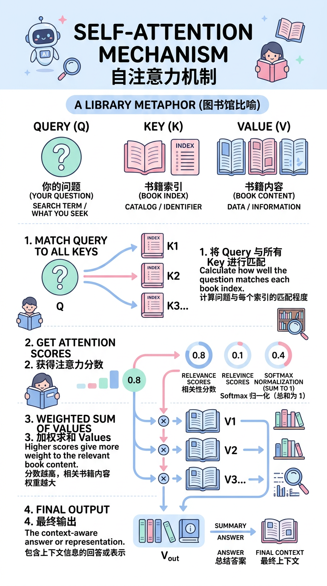
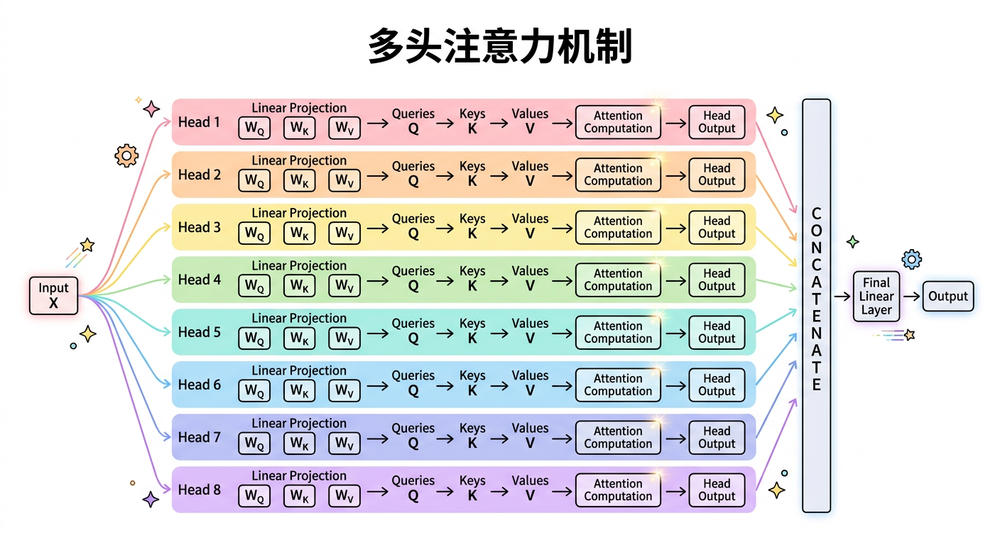
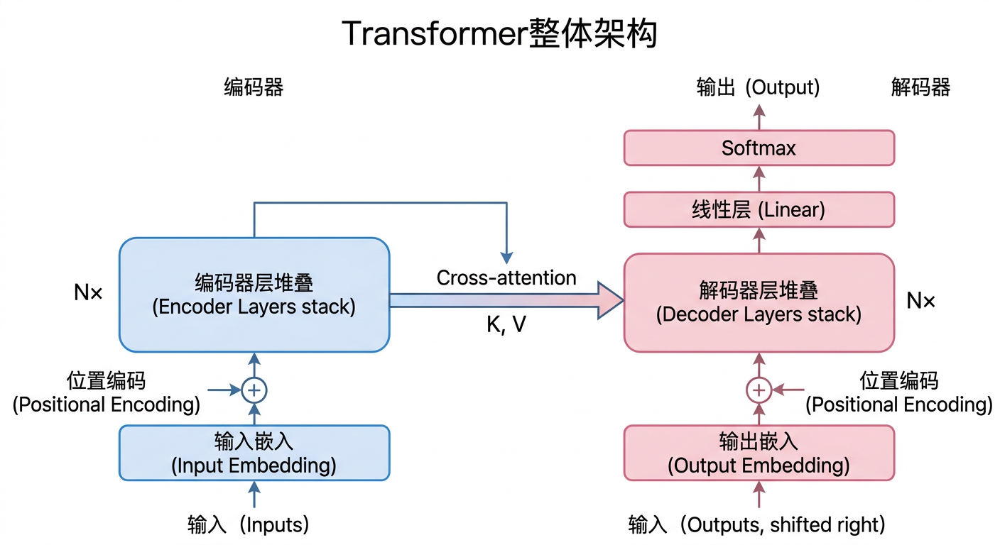
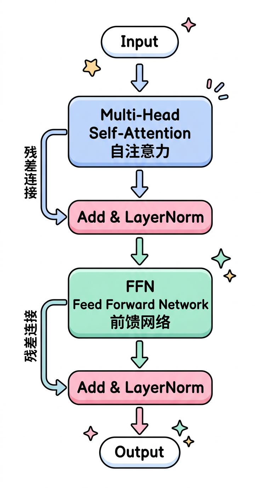

# 第三章：Transformer架构深度解析

## 学习目标

完成本章学习后，你将能够：
- 深入理解Self-Attention机制的原理与计算过程
- 掌握Multi-Head Attention的设计思想
- 理解位置编码的必要性及各种方案
- 完整理解Transformer的Encoder-Decoder架构
- 能够手推Attention公式并分析复杂度

---

## 3.1 从RNN到Attention

### RNN的局限性

**问题1：难以并行**
```
RNN必须按顺序处理：
h₁ = f(x₁, h₀) → h₂ = f(x₂, h₁) → h₃ = f(x₃, h₂) → ...

必须等h₁算完才能算h₂，无法并行利用GPU
```

**问题2：长距离依赖困难**
```
序列：[x₁, x₂, ..., x₁₀₀]

x₁的信息要传到x₁₀₀需要经过99次传递
每次传递都会衰减，导致远距离信息丢失
```

### Attention的核心思想

**核心问题**：如何让序列中的每个位置都能"看到"其他所有位置？

**Attention的解决方案**：直接计算任意两个位置之间的关联度

```
传统RNN：x₁ → x₂ → x₃ → x₄    （信息逐步传递）

Attention：
x₁ ─────┼─────┼─────┼
        │     │     │
x₂ ─────┼─────┼─────┼     （任意位置可直接交互）
        │     │     │
x₃ ─────┼─────┼─────┼
        │     │     │
x₄ ─────┼─────┼─────┼
```

---

## 3.2 Self-Attention机制

### Query, Key, Value的直觉



**检索过程**：
1. 拿Query和每个Key比较，计算相关性分数
2. 根据分数对Value加权求和
3. 得到和Query最相关的信息汇总

### Self-Attention计算步骤

**输入**：序列 X ∈ ℝⁿˣᵈ （n个token，每个d维）

**Step 1：生成Q, K, V**

```
Q = X · Wq    (Query矩阵)
K = X · Wk    (Key矩阵)
V = X · Wv    (Value矩阵)

其中 Wq, Wk, Wv ∈ ℝᵈˣᵈₖ 是可学习参数
```

**Step 2：计算注意力分数**

```
Attention(Q, K, V) = softmax(QKᵀ / √dₖ) · V
```

详细展开：

```
1. 计算相似度：S = Q · Kᵀ ∈ ℝⁿˣⁿ
   S[i,j] 表示位置i对位置j的关注程度

2. 缩放：S = S / √dₖ
   防止点积过大导致softmax梯度消失

3. Softmax归一化：A = softmax(S)
   每行和为1，表示注意力权重分布

4. 加权求和：Output = A · V
   用注意力权重对Value加权
```

### 图解Self-Attention

```
输入序列 X: ["I", "love", "AI"]

         Q    K    V
          ↓    ↓    ↓
    I  → [q₁] [k₁] [v₁]
  love → [q₂] [k₂] [v₂]
    AI → [q₃] [k₃] [v₃]

注意力分数矩阵 A = softmax(QKᵀ/√d):

         k₁    k₂    k₃
    q₁ [ 0.7   0.2   0.1 ]  ← "I"关注的分布
    q₂ [ 0.3   0.4   0.3 ]  ← "love"关注的分布
    q₃ [ 0.2   0.3   0.5 ]  ← "AI"关注的分布

输出 = A · V:
    out₁ = 0.7·v₁ + 0.2·v₂ + 0.1·v₃
    out₂ = 0.3·v₁ + 0.4·v₂ + 0.3·v₃
    out₃ = 0.2·v₁ + 0.3·v₂ + 0.5·v₃
```

### 为什么需要缩放因子 √dₖ？

**问题**：当dₖ较大时，Q·K的点积值会很大

```
假设q和k的每个元素独立同分布，均值0，方差1

E[qᵀk] = 0
Var[qᵀk] = dₖ

当dₖ=512时，点积的标准差≈22.6
```

**后果**：点积值过大 → softmax输出接近one-hot → 梯度消失

**解决**：除以√dₖ，使方差稳定在1

```
Var[(qᵀk)/√dₖ] = Var[qᵀk]/dₖ = dₖ/dₖ = 1
```

---

## 3.3 Multi-Head Attention

### 为什么需要多头？

单头Attention的问题：
- 只能学习一种attention模式
- 表达能力受限

**多头的好处**：
- 不同的头可以关注不同类型的信息
- 类似CNN中多个卷积核提取不同特征

### Multi-Head Attention结构

```
MultiHead(Q, K, V) = Concat(head₁, ..., headₕ) · Wᴼ

其中 headᵢ = Attention(Q·Wᵢᵠ, K·Wᵢᴷ, V·Wᵢⱽ)
```

**参数设计**：
```
假设模型维度 d_model = 512，头数 h = 8

每个头的维度：dₖ = dᵥ = d_model / h = 64

Wᵢᵠ, Wᵢᴷ, Wᵢⱽ ∈ ℝ⁵¹²ˣ⁶⁴
Wᴼ ∈ ℝ⁵¹²ˣ⁵¹²
```

### 计算流程图



### 不同头学到什么？

研究发现，不同的头会学习不同类型的关系：
- **语法头**：关注句法结构（主谓、定中关系）
- **位置头**：关注相对位置
- **语义头**：关注语义相关性
- **特殊头**：关注标点、特殊token

---

## 3.4 位置编码

### 为什么需要位置编码？

Self-Attention是**置换不变**的：

```
Attention([A, B, C]) 的结果
与
Attention([C, A, B]) 的结果

对应位置相同（只是顺序不同）
```

**问题**：模型无法区分"狗咬人"和"人咬狗"

**解决**：通过位置编码注入位置信息

### 正弦位置编码（Sinusoidal）

原始Transformer使用的方案：

```
PE(pos, 2i)   = sin(pos / 10000^(2i/d))
PE(pos, 2i+1) = cos(pos / 10000^(2i/d))

其中：
- pos: token在序列中的位置
- i: 维度索引
- d: 模型维度
```

**设计思想**：

1. **不同频率**：每个维度使用不同频率的正弦/余弦
   - 低维度：高频，捕捉近距离关系
   - 高维度：低频，捕捉远距离关系

2. **相对位置可学习**：PE(pos+k) 可以表示为 PE(pos) 的线性变换

**可视化**：

```
位置  dim0(高频)  dim1(中频)  dim2(低频)
  0      0.00       0.00       0.00
  1      0.84       0.31       0.10
  2      0.91       0.59       0.20
  3      0.14       0.81       0.30
  ...
```

### 可学习位置编码

BERT、GPT等模型使用可学习的位置嵌入：

```
position_embedding = Embedding(max_length, d_model)
output = token_embedding + position_embedding[position]
```

**优点**：更灵活，模型自动学习
**缺点**：无法处理超出训练长度的序列

### RoPE（Rotary Position Embedding）

LLaMA、ChatGLM等现代模型使用的方案：

**核心思想**：用旋转矩阵编码相对位置

```
将向量看作复数，通过旋转来编码位置：
f(x, m) = x · e^(imθ)

在实数域的实现：
[cos(mθ)  -sin(mθ)] [x₁]
[sin(mθ)   cos(mθ)] [x₂]
```

**优势**：
1. 天然支持相对位置
2. 可扩展到任意长度
3. 远距离衰减特性

### 位置编码对比

| 方案 | 特点 | 长度外推 | 代表模型 |
|-----|------|---------|---------|
| 正弦编码 | 固定、不可学习 | 一般 | 原始Transformer |
| 可学习 | 灵活、需要训练 | 差 | BERT、GPT-2 |
| RoPE | 旋转、相对位置 | 好 | LLaMA、ChatGLM |
| ALiBi | 注意力偏置 | 很好 | BLOOM |

---

## 3.5 Transformer整体架构

### 原始Transformer（Encoder-Decoder）



### Encoder Layer结构



### Decoder Layer结构

Decoder Layer比Encoder多一层**Cross-Attention**，用于关注Encoder的输出：

| 组件 | 说明 |
|-----|------|
| **Masked Self-Attention** | 只能看到当前位置之前的token |
| **Cross-Attention** | Q来自Decoder，K/V来自Encoder |
| **FFN** | 位置独立的前馈网络 |

### Feed Forward Network (FFN)

```
FFN(x) = GELU(x · W₁ + b₁) · W₂ + b₂

通常：
- 输入维度：d_model (如512)
- 隐藏维度：4 × d_model (如2048)
- 输出维度：d_model (如512)
```

**作用**：
- 对每个位置独立进行非线性变换
- 类似于1×1卷积，增加模型容量

### Masked Attention

在Decoder中，需要防止"看到未来"：

```
原始注意力矩阵：        Mask矩阵：           Masked后：
┌─────────────┐      ┌─────────────┐      ┌─────────────┐
│ a₁₁ a₁₂ a₁₃│      │  0   -∞  -∞ │      │ a₁₁  -∞  -∞ │
│ a₂₁ a₂₂ a₂₃│  +   │  0    0  -∞ │  =   │ a₂₁ a₂₂  -∞ │
│ a₃₁ a₃₂ a₃₃│      │  0    0   0 │      │ a₃₁ a₃₂ a₃₃│
└─────────────┘      └─────────────┘      └─────────────┘

softmax后，-∞位置变成0，确保每个位置只能看到之前的token
```

---

## 3.6 Pre-Norm vs Post-Norm

### 两种归一化位置

**Post-Norm（原始Transformer）**：
```
x = x + Attention(LayerNorm(x))  ✗
x = LayerNorm(x + Attention(x))  ✓ Post-Norm
```

**Pre-Norm（现代模型常用）**：
```
x = x + Attention(LayerNorm(x))  ✓ Pre-Norm
```

### 对比

| 维度 | Post-Norm | Pre-Norm |
|-----|-----------|----------|
| 训练稳定性 | 需要warmup | 更稳定 |
| 最终性能 | 略好 | 略差 |
| 深层网络 | 困难 | 容易 |
| 代表模型 | BERT | GPT、LLaMA |

**Pre-Norm为什么更稳定**：
- 残差路径上的信号更直接
- 梯度流动更顺畅

---

## 3.7 复杂度分析

### 时间复杂度

```
Self-Attention:
- QKᵀ计算：O(n² · d)
- Softmax：O(n²)
- 与V相乘：O(n² · d)
总计：O(n² · d)

FFN:
- 第一层：O(n · d · 4d)
- 第二层：O(n · 4d · d)
总计：O(n · d²)

单层Transformer：O(n²·d + n·d²)
```

### 空间复杂度

```
需要存储的中间结果：
- 注意力矩阵：O(n²)
- Q, K, V：O(n·d)
- FFN中间层：O(n·4d)

主要瓶颈：n²的注意力矩阵
```

### 与序列长度的关系

```
复杂度
  │
  │           Transformer
  │          ╱ O(n²)
  │         ╱
  │        ╱
  │       ╱
  │      ╱────── RNN O(n)
  │     ╱
  │    ╱
  └───┴──────────────────→ 序列长度n
```

**Transformer的n²复杂度是长序列处理的主要瓶颈**

---

## 3.8 代码实现

### Self-Attention实现

```python
import torch
import torch.nn as nn
import torch.nn.functional as F
import math

class SelfAttention(nn.Module):
    def __init__(self, d_model, d_k):
        super().__init__()
        self.d_k = d_k
        self.W_q = nn.Linear(d_model, d_k)
        self.W_k = nn.Linear(d_model, d_k)
        self.W_v = nn.Linear(d_model, d_k)

    def forward(self, x, mask=None):
        # x: (batch, seq_len, d_model)
        Q = self.W_q(x)  # (batch, seq_len, d_k)
        K = self.W_k(x)
        V = self.W_v(x)

        # 计算注意力分数
        scores = torch.matmul(Q, K.transpose(-2, -1)) / math.sqrt(self.d_k)
        # scores: (batch, seq_len, seq_len)

        # 应用mask
        if mask is not None:
            scores = scores.masked_fill(mask == 0, -1e9)

        # Softmax
        attn = F.softmax(scores, dim=-1)

        # 加权求和
        output = torch.matmul(attn, V)

        return output, attn
```

### Multi-Head Attention实现

```python
class MultiHeadAttention(nn.Module):
    def __init__(self, d_model, num_heads):
        super().__init__()
        assert d_model % num_heads == 0

        self.d_model = d_model
        self.num_heads = num_heads
        self.d_k = d_model // num_heads

        self.W_q = nn.Linear(d_model, d_model)
        self.W_k = nn.Linear(d_model, d_model)
        self.W_v = nn.Linear(d_model, d_model)
        self.W_o = nn.Linear(d_model, d_model)

    def forward(self, x, mask=None):
        batch_size, seq_len, _ = x.size()

        # 线性变换并分头
        Q = self.W_q(x).view(batch_size, seq_len, self.num_heads, self.d_k).transpose(1, 2)
        K = self.W_k(x).view(batch_size, seq_len, self.num_heads, self.d_k).transpose(1, 2)
        V = self.W_v(x).view(batch_size, seq_len, self.num_heads, self.d_k).transpose(1, 2)
        # Q, K, V: (batch, num_heads, seq_len, d_k)

        # 计算注意力
        scores = torch.matmul(Q, K.transpose(-2, -1)) / math.sqrt(self.d_k)
        if mask is not None:
            scores = scores.masked_fill(mask == 0, -1e9)
        attn = F.softmax(scores, dim=-1)
        context = torch.matmul(attn, V)

        # 合并多头
        context = context.transpose(1, 2).contiguous().view(batch_size, seq_len, self.d_model)
        output = self.W_o(context)

        return output
```

---

## 3.9 本章小结

### 核心要点回顾

1. **Self-Attention**：Q·Kᵀ计算相似度，softmax归一化，对V加权求和
2. **缩放因子**：√dₖ防止梯度消失
3. **Multi-Head**：多角度关注不同信息
4. **位置编码**：弥补Attention的位置无关性
5. **Pre-Norm vs Post-Norm**：Pre-Norm更稳定，Post-Norm性能略好

### Transformer核心公式

```
Attention(Q, K, V) = softmax(QKᵀ/√dₖ) · V

MultiHead(Q, K, V) = Concat(head₁, ..., headₕ) · Wᴼ

Transformer Layer:
  x = x + MultiHeadAttention(LayerNorm(x))
  x = x + FFN(LayerNorm(x))
```

---

## 延伸阅读

### 必读论文

1. **Attention Is All You Need** (2017) - Transformer原文
2. **BERT** (2018) - Encoder-only架构
3. **GPT** (2018) - Decoder-only架构
4. **RoFormer** (2021) - RoPE位置编码

### 推荐资源

- [The Illustrated Transformer](http://jalammar.github.io/illustrated-transformer/)
- [The Annotated Transformer](http://nlp.seas.harvard.edu/annotated-transformer/)
- [Attention? Attention!](https://lilianweng.github.io/posts/2018-06-24-attention/)

---

下一章：[第四章：大语言模型架构演进](../第四章_大语言模型架构演进/01_正文.md)
