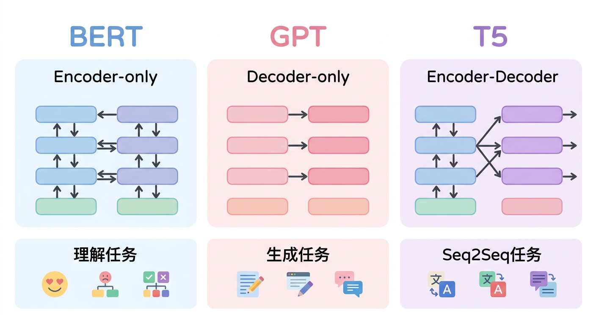
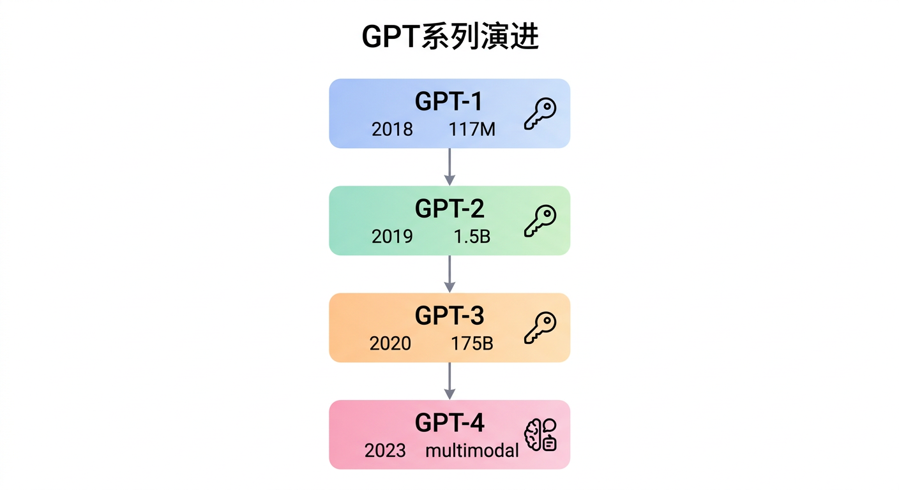
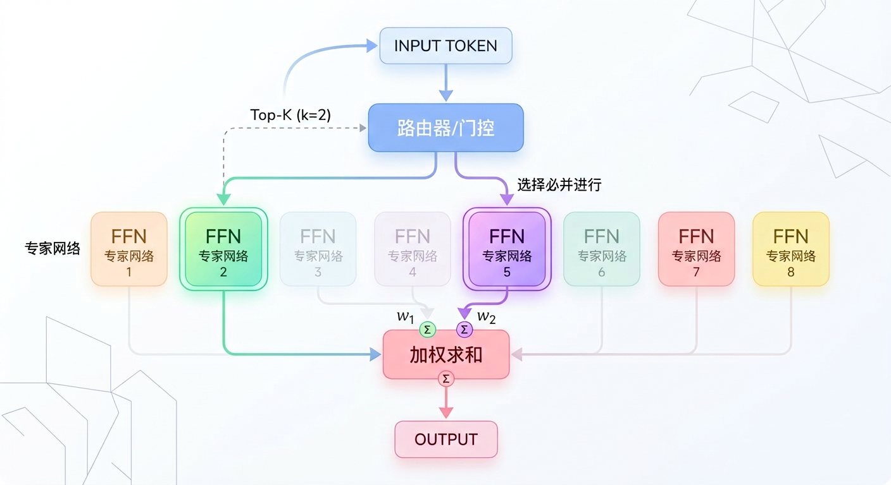

# 第四章：大语言模型架构演进

## 学习目标

完成本章学习后，你将能够：
- 理解GPT系列从GPT-1到GPT-4的架构演进
- 掌握BERT与GPT的核心设计差异
- 熟悉LLaMA、Mistral等开源模型的架构特点
- 理解MoE（混合专家）架构的原理和优势

---

## 4.1 语言模型基础

### 什么是语言模型？

**语言模型**是对语言序列概率分布的建模：

```
P(w₁, w₂, ..., wₙ) = P(w₁) × P(w₂|w₁) × P(w₃|w₁,w₂) × ... × P(wₙ|w₁,...,wₙ₋₁)
```

**两种主要建模方式**：

| 类型 | 目标 | 代表模型 |
|-----|------|---------|
| 自回归 (AR) | P(wₜ\|w₁,...,wₜ₋₁)，预测下一个词 | GPT系列 |
| 自编码 (AE) | 从损坏的输入重建原始输入 | BERT |

### 三种Transformer架构



---

## 4.2 GPT系列演进



### GPT-1 (2018)

**核心创新**：预训练+微调范式

```
阶段1：无监督预训练
- 数据：BookCorpus（约5GB文本）
- 目标：自回归语言建模 P(wₜ|w₁,...,wₜ₋₁)
- 架构：12层Transformer Decoder

阶段2：有监督微调
- 针对具体任务（分类、问答等）
- 只需少量标注数据
```

**架构参数**：
| 参数 | 值 |
|-----|-----|
| 层数 | 12 |
| 隐藏维度 | 768 |
| 注意力头数 | 12 |
| 参数量 | 117M |

### GPT-2 (2019)

**核心创新**：Zero-shot能力的展现

**关键变化**：
- 规模扩大：1.5B参数
- 更大数据：WebText（40GB，800万网页）
- 任务统一：所有任务转化为文本生成

```
传统方式：每个任务一个模型头
GPT-2方式：所有任务用生成来解决

翻译：Translate English to French: [text] →
摘要：TL;DR: [text] →
问答：Q: [question] A: →
```

**架构改进**：
- Layer Normalization移到block输入（Pre-Norm）
- 词表扩大到50257（BPE）
- 上下文长度：1024

### GPT-3 (2020)

**核心突破**：涌现能力与Few-shot学习

**规模飞跃**：

| 模型 | 参数量 | 训练数据 |
|-----|-------|---------|
| GPT-2 | 1.5B | 40GB |
| GPT-3 | 175B | 570GB |

**In-Context Learning**：无需微调，仅通过提示学习新任务

```
Zero-shot：直接描述任务
One-shot：给一个例子
Few-shot：给几个例子

示例：
翻译以下句子：
English: Hello
French: Bonjour
English: Good morning
French: ← 模型预测
```

**架构细节**：
- 96层Transformer
- 隐藏维度12288
- 96个注意力头
- 上下文长度2048

### GPT-4 (2023)

**主要特点**（推测，OpenAI未公开细节）：

1. **多模态**：支持图像输入
2. **更长上下文**：8K/32K/128K
3. **更强推理**：复杂任务表现显著提升
4. **MoE架构**（传闻）：可能采用混合专家架构

---

## 4.3 BERT架构

### 核心设计

**双向编码器**：不同于GPT的单向，BERT能看到完整上下文

```
GPT（单向）：
"我 喜欢 [MASK] 学习"
预测时只能看到"我 喜欢"

BERT（双向）：
"我 喜欢 [MASK] 学习"
预测时能看到"我 喜欢"和"学习"
```

### 预训练任务

**1. Masked Language Model (MLM)**

```
输入：我 喜欢 [MASK] 学习
目标：预测被mask的词是"AI"

Mask策略（15%的token）：
- 80%替换为[MASK]
- 10%替换为随机词
- 10%保持不变
```

**2. Next Sentence Prediction (NSP)**

```
输入：[CLS] 句子A [SEP] 句子B [SEP]
目标：预测B是否是A的下一句

正例：A的真实下一句
负例：随机采样的句子
```

### BERT vs GPT对比

| 维度 | BERT | GPT |
|-----|------|-----|
| 架构 | Encoder-only | Decoder-only |
| 注意力 | 双向 | 单向（causal） |
| 预训练任务 | MLM + NSP | 自回归LM |
| 适合任务 | 理解（分类、NER） | 生成（对话、写作） |
| 微调方式 | 添加任务头 | 提示工程/微调 |

### 为什么大模型选择GPT架构？

1. **统一的生成范式**：所有任务都可以转化为生成
2. **自然的Few-shot**：自回归天然支持上下文学习
3. **易于扩展**：生成任务的评估和扩展更简单
4. **对齐友好**：RLHF等对齐技术更适合生成模型

---

## 4.4 LLaMA架构

### LLaMA-1 (2023)

Meta开源的高效大模型，证明了"小模型+大数据"的有效性。

**设计理念**：
- 遵循Chinchilla定律
- 7B模型用1T token训练（而非GPT-3的300B）

**架构改进**：

| 组件 | GPT | LLaMA |
|-----|-----|-------|
| 归一化 | LayerNorm | RMSNorm |
| 激活函数 | GELU | SwiGLU |
| 位置编码 | 绝对位置 | RoPE |
| 注意力 | 标准MHA | 标准MHA |

### RMSNorm

```
标准LayerNorm:
y = (x - μ) / σ × γ + β

RMSNorm（去掉均值）:
y = x / RMS(x) × γ
RMS(x) = √(Σxᵢ²/n)
```

**优势**：计算更简单，效果相当

### SwiGLU激活

```
标准FFN:
FFN(x) = GELU(xW₁)W₂

SwiGLU:
FFN(x) = (Swish(xW₁) ⊙ xW₃)W₂

Swish(x) = x × sigmoid(x)
```

**特点**：引入门控机制，提升表达能力

### LLaMA-2 (2023)

**主要改进**：
- 训练数据：1T → 2T tokens
- 上下文长度：2K → 4K
- GQA（Grouped Query Attention）

**GQA（分组查询注意力）**：

```
MHA：每个头有独立的K、V
GQA：多个头共享K、V

MHA: Q(32头) + K(32头) + V(32头)
GQA: Q(32头) + K(8组) + V(8组)

减少KV cache，提升推理效率
```

### LLaMA-3 (2024)

**主要变化**：
- 更大词表：32K → 128K
- 更长上下文：8K → 128K（3.1版本）
- 更大规模：8B, 70B, 405B

---

## 4.5 其他重要架构

### Mistral (2023)

**创新点**：Sliding Window Attention

```
标准Attention：每个token关注所有token，O(n²)

Sliding Window：每个token只关注窗口内的token

窗口大小W=4096时：
位置i只关注位置[i-4096, i]的token

多层堆叠后，感受野扩大：
L层后感受野 = L × W
```

**优势**：
- 降低计算复杂度
- 减少内存占用
- 保持长距离建模能力（通过层堆叠）

### ChatGLM

**特点**：
- 中英双语优化
- 前缀语言模型（Prefix LM）
- GLU激活函数

**Prefix LM**：
```
输入：[Prefix（双向）][Generation（单向）]

Prefix部分：可以双向attention
Generation部分：单向attention

结合了BERT的理解能力和GPT的生成能力
```

### Qwen

**特点**：
- 阿里开源
- 支持超长上下文（32K+）
- 强化中文能力

---

## 4.6 MoE（混合专家）架构

### 基本原理

**核心思想**：不是所有参数都参与每个token的计算

```
传统Dense模型：
每个token经过所有FFN参数

MoE模型：
每个token只激活部分"专家"（Expert）
由"门控网络"（Router）决定激活哪些专家
```

### MoE结构



### Router机制

```python
# 门控网络计算
gate_logits = x @ W_gate  # (batch, seq, num_experts)
gate_probs = softmax(gate_logits)

# 选择Top-K专家
top_k_probs, top_k_indices = topk(gate_probs, k=2)

# 重新归一化
top_k_probs = top_k_probs / top_k_probs.sum()

# 计算输出
output = sum(prob * expert(x) for prob, expert in zip(top_k_probs, selected_experts))
```

### MoE的优势与挑战

**优势**：

| 优势 | 说明 |
|-----|------|
| 计算效率 | 总参数量大，但每个token只用部分参数 |
| 模型容量 | 可以训练更大的模型 |
| 专业化 | 不同专家可以专注不同类型的知识 |

**挑战**：

| 挑战 | 解决方案 |
|-----|---------|
| 负载均衡 | 辅助损失函数强制均匀分配 |
| 通信开销 | 专家并行策略 |
| 训练不稳定 | Router正则化 |

### 代表模型

| 模型 | 专家数 | 激活专家 | 总参数 | 激活参数 |
|-----|-------|---------|-------|---------|
| Mixtral 8x7B | 8 | 2 | 46.7B | 12.9B |
| GPT-4（推测） | ~16 | 2 | ~1.8T | ~220B |
| DeepSeek-MoE | 64 | 6 | - | - |

---

## 4.7 架构对比总结

### 主流模型架构对比

| 模型 | 架构类型 | Norm | 激活 | 位置编码 | 特色 |
|-----|---------|------|-----|---------|------|
| GPT-3 | Decoder | Post-LN | GELU | 学习式 | 涌现能力 |
| BERT | Encoder | Post-LN | GELU | 学习式 | 双向理解 |
| LLaMA | Decoder | Pre-RMSNorm | SwiGLU | RoPE | 高效开源 |
| Mistral | Decoder | Pre-RMSNorm | SwiGLU | RoPE | 滑动窗口 |
| Mixtral | MoE | Pre-RMSNorm | SwiGLU | RoPE | 稀疏激活 |

### 架构选择指南

```
任务类型                      推荐架构
   │
   ├── 文本理解（分类、NER）───→ Encoder (BERT类)
   │
   ├── 文本生成（对话、写作）──→ Decoder (GPT/LLaMA类)
   │
   ├── Seq2Seq（翻译、摘要）──→ Encoder-Decoder (T5类)
   │
   └── 超大规模模型 ─────────→ MoE架构
```

---

## 4.8 本章小结

### 核心要点回顾

1. **三种架构**：Encoder-only、Decoder-only、Encoder-Decoder
2. **GPT演进**：规模扩大 → 涌现能力 → 多模态
3. **BERT vs GPT**：双向理解 vs 单向生成
4. **LLaMA创新**：RMSNorm、SwiGLU、RoPE
5. **MoE架构**：稀疏激活，扩大容量

### 现代LLM架构标配

```
1. Decoder-only架构
2. Pre-Norm (RMSNorm)
3. SwiGLU激活函数
4. RoPE位置编码
5. GQA（大模型）
6. MoE（超大模型）
```

---

## 延伸阅读

### 必读论文

1. **GPT-1**: Improving Language Understanding by Generative Pre-Training
2. **GPT-2**: Language Models are Unsupervised Multitask Learners
3. **GPT-3**: Language Models are Few-Shot Learners
4. **BERT**: Pre-training of Deep Bidirectional Transformers
5. **LLaMA**: Open and Efficient Foundation Language Models
6. **Mixtral**: Mixtral of Experts

### 推荐资源

- [Andrej Karpathy: Let's build GPT](https://www.youtube.com/watch?v=kCc8FmEb1nY)
- [The Illustrated GPT-2](http://jalammar.github.io/illustrated-gpt2/)
- [LLaMA技术报告](https://arxiv.org/abs/2302.13971)

---

下一章：[第五章：大模型训练技术](../第五章_大模型训练技术/01_正文.md)
