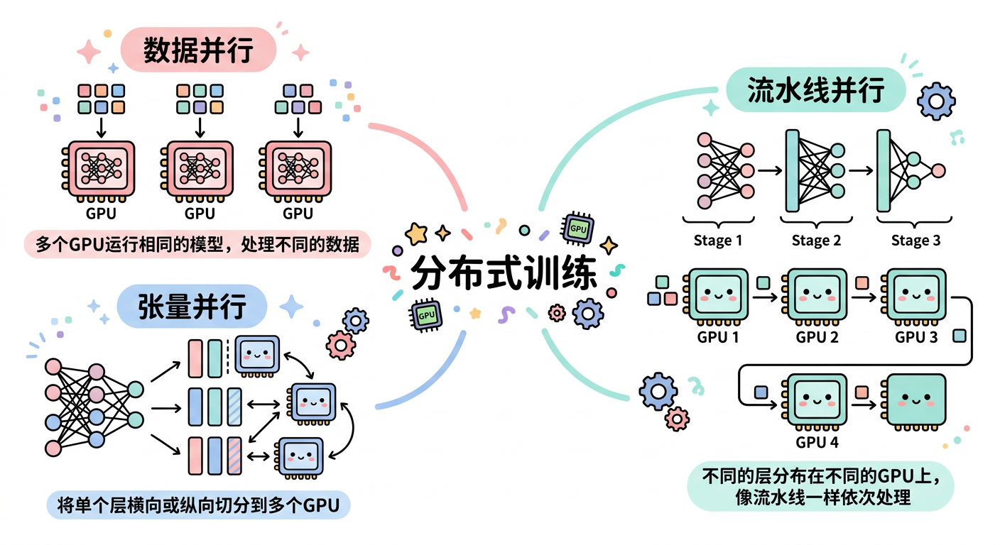
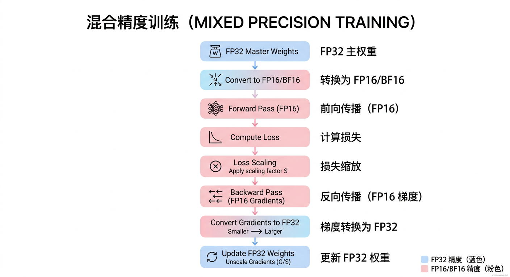

# 第五章：大模型训练技术

## 学习目标

完成本章学习后，你将能够：
- 理解大模型预训练的目标函数和数据处理
- 掌握分布式训练的各种并行策略
- 理解混合精度训练和梯度检查点技术
- 熟悉DeepSpeed ZeRO等内存优化技术

---

## 5.1 预训练目标

### 自回归语言模型（Causal LM）

**目标**：预测下一个token

```
P(x₁, x₂, ..., xₙ) = ∏ᵢ P(xᵢ | x₁, ..., xᵢ₋₁)

损失函数：L = -Σᵢ log P(xᵢ | x<ᵢ)
```

**特点**：
- GPT系列使用
- 单向注意力（只看过去）
- 天然支持文本生成

### 掩码语言模型（Masked LM）

**目标**：预测被遮盖的token

```
随机遮盖15%的token
预测被遮盖的原始token

损失函数：L = -Σᵢ∈masked log P(xᵢ | x_unmasked)
```

**特点**：
- BERT使用
- 双向注意力
- 适合理解任务

### Span Corruption（T5）

**目标**：预测被遮盖的连续片段

```
输入：The <X> brown <Y> over the lazy dog
输出：<X> quick <Y> fox jumps

遮盖连续span，而非单个token
```

---

## 5.2 训练数据

### 数据来源

| 数据类型 | 来源 | 特点 |
|---------|------|------|
| 网页 | Common Crawl | 量大、噪声多 |
| 书籍 | Books3, Gutenberg | 高质量、结构化 |
| 代码 | GitHub, Stack Overflow | 编程能力 |
| 论文 | arXiv, PubMed | 专业知识 |
| 对话 | Reddit, Forums | 对话能力 |
| 百科 | Wikipedia | 知识密集 |

### 数据处理流程

```
原始数据
    │
    ↓ 去重（MinHash、SimHash）
    │
    ↓ 质量过滤（语言检测、内容过滤）
    │
    ↓ 敏感信息处理（PII移除）
    │
    ↓ Tokenization
    │
    ↓ 打包成训练样本
    │
训练数据
```

### 数据配比

**典型配比（参考LLaMA）**：

| 数据源 | 比例 | 采样权重 |
|-------|------|---------|
| Common Crawl | 67% | 1.0 |
| C4 | 15% | 1.0 |
| GitHub | 4.5% | 0.5 |
| Wikipedia | 4.5% | 2.0 |
| Books | 4.5% | 2.0 |
| ArXiv | 2.5% | 1.0 |
| Stack Exchange | 2% | 1.0 |

**注意**：高质量数据通常会被多次采样（epoch > 1）

---

## 5.3 分布式训练基础

### 为什么需要分布式？

```
GPT-3训练需求：
- 模型参数：175B × 4字节 = 700GB
- 优化器状态（Adam）：175B × 12字节 = 2100GB
- 梯度：175B × 4字节 = 700GB
- 激活值：根据batch size变化

单张A100（80GB）远远不够
需要数千张GPU协同训练
```

### 并行策略概览



---

## 5.4 数据并行

### 基本数据并行（DP/DDP）

**原理**：每个GPU持有完整模型，处理不同数据

```
┌─────────────────────────────────────────────────────────────┐
│                       数据并行                               │
│                                                             │
│    数据batch                                                │
│    [B₀ B₁ B₂ B₃]                                           │
│         │                                                   │
│    ┌────┼────┬────┬────┐                                   │
│    ↓    ↓    ↓    ↓    ↓                                   │
│  ┌───┐┌───┐┌───┐┌───┐                                      │
│  │GPU││GPU││GPU││GPU│  每个GPU有完整模型                   │
│  │ 0 ││ 1 ││ 2 ││ 3 │                                      │
│  └───┘└───┘└───┘└───┘                                      │
│    │    │    │    │                                        │
│    └────┴────┴────┘                                        │
│         │                                                   │
│    AllReduce（梯度同步）                                     │
│         │                                                   │
│    更新参数                                                  │
└─────────────────────────────────────────────────────────────┘
```

**DDP vs DP**：

| 特性 | DP | DDP |
|-----|-----|-----|
| 通信 | 参数服务器模式 | Ring AllReduce |
| 效率 | 通信瓶颈 | 更高效 |
| 多机 | 不支持 | 支持 |
| 推荐 | 不推荐 | 推荐 |

### ZeRO优化

**问题**：每个GPU都存储完整的模型状态，内存浪费

**ZeRO（Zero Redundancy Optimizer）**：分片存储，按需聚合

```
内存占用（175B模型，FP16）：
- 参数：350GB
- 梯度：350GB
- 优化器状态：1400GB（Adam的m和v）
总计：2100GB

ZeRO分片后（64 GPU）：
- 每GPU：2100GB / 64 ≈ 33GB
```

**三个阶段**：

| 阶段 | 分片内容 | 内存节省 |
|-----|---------|---------|
| ZeRO-1 | 优化器状态 | 4× |
| ZeRO-2 | + 梯度 | 8× |
| ZeRO-3 | + 参数 | N× (N=GPU数) |

**ZeRO-3示意图**：

```
GPU 0        GPU 1        GPU 2        GPU 3
┌────┐       ┌────┐       ┌────┐       ┌────┐
│P₀  │       │P₁  │       │P₂  │       │P₃  │  参数分片
│G₀  │       │G₁  │       │G₂  │       │G₃  │  梯度分片
│O₀  │       │O₁  │       │O₂  │       │O₃  │  优化器分片
└────┘       └────┘       └────┘       └────┘

前向时：AllGather收集需要的参数
反向时：ReduceScatter分发梯度
更新时：各自更新自己的分片
```

---

## 5.5 模型并行

### 张量并行（Tensor Parallelism）

**原理**：将单个层的计算分布到多个GPU

**以线性层为例**：

```
Y = XW，其中W ∈ ℝᵈˣᵈ

列切分：
W = [W₁, W₂]
Y = X[W₁, W₂] = [XW₁, XW₂] = [Y₁, Y₂]

GPU 0计算XW₁
GPU 1计算XW₂
最后拼接
```

**MLP层的张量并行**：

```
标准MLP：Y = GELU(XW₁)W₂

张量并行：
┌─────────────────────────────────────────┐
│ GPU 0                    GPU 1          │
│                                         │
│ X ──→ W₁ᵃ ──→ GELU ──→ W₂ᵃ ──┐         │
│                              │ AllReduce│
│ X ──→ W₁ᵇ ──→ GELU ──→ W₂ᵇ ──┘         │
│                              ↓          │
│                              Y          │
└─────────────────────────────────────────┘
```

**Attention层的张量并行**：

```
多头注意力天然适合张量并行：
每个GPU负责部分注意力头

8头注意力 + 2 GPU：
GPU 0: 头1,2,3,4
GPU 1: 头5,6,7,8
```

### 流水线并行（Pipeline Parallelism）

**原理**：将模型按层切分，不同GPU负责不同层

```
┌────────────────────────────────────────────────────────┐
│ 4层模型 + 4 GPU                                         │
│                                                        │
│ GPU 0    GPU 1    GPU 2    GPU 3                       │
│ ┌─────┐  ┌─────┐  ┌─────┐  ┌─────┐                    │
│ │Layer│→ │Layer│→ │Layer│→ │Layer│                    │
│ │ 0-1 │  │ 2-3 │  │ 4-5 │  │ 6-7 │                    │
│ └─────┘  └─────┘  └─────┘  └─────┘                    │
└────────────────────────────────────────────────────────┘
```

**问题**：Pipeline Bubble（流水线气泡）

```
朴素流水线（1个micro-batch）：
GPU 0: ████░░░░░░░░████░░░░
GPU 1: ░░░░████░░░░░░░░████
GPU 2: ░░░░░░░░████░░░░░░░░
         前向↑    反向↑    闲置░

气泡比例 ≈ (P-1)/P，P=GPU数
```

**解决：Micro-batching**

```
将batch分成多个micro-batch，交错执行

GPU 0: F₁F₂F₃F₄░░░░B₄B₃B₂B₁
GPU 1: ░░F₁F₂F₃F₄░░B₄B₃B₂B₁
GPU 2: ░░░░F₁F₂F₃F₄B₄B₃B₂B₁

显著减少气泡
```

---

## 5.6 3D并行

### 组合策略

```
大规模训练通常结合三种并行：

┌───────────────────────────────────────────────────────────┐
│                        3D并行                             │
│                                                           │
│  数据并行（DP）× 张量并行（TP）× 流水线并行（PP）           │
│                                                           │
│  示例：512 GPU训练                                         │
│  - DP = 64（64份数据并行）                                │
│  - TP = 4（每层分到4个GPU）                               │
│  - PP = 2（模型分成2段）                                  │
│                                                           │
│  64 × 4 × 2 = 512 GPU                                    │
└───────────────────────────────────────────────────────────┘
```

### Megatron-LM策略

```
节点内：张量并行（高带宽NVLink）
节点间：流水线并行 + 数据并行（相对低带宽）

原因：
- 张量并行通信频繁，需要高带宽
- 流水线并行通信较少，可跨节点
```

---

## 5.7 混合精度训练

### 数据类型对比

| 类型 | 位数 | 范围 | 用途 |
|-----|-----|------|------|
| FP32 | 32 | ±3.4×10³⁸ | 传统训练 |
| FP16 | 16 | ±65504 | 混合精度 |
| BF16 | 16 | ±3.4×10³⁸ | 大模型训练 |
| TF32 | 19 | ±3.4×10³⁸ | A100默认 |

**BF16 vs FP16**：

```
FP16: 1位符号 + 5位指数 + 10位尾数
BF16: 1位符号 + 8位指数 + 7位尾数

BF16优势：
- 范围与FP32相同，不易溢出
- 大模型训练更稳定
- A100/H100原生支持
```

### 混合精度训练流程



**Loss Scaling**（FP16需要）：

```
问题：FP16的小梯度可能下溢为0

解决：
1. Loss乘以缩放因子S（如1024）
2. 梯度也被放大S倍
3. 更新前梯度除以S

动态Loss Scaling：
- 无溢出时增大S
- 溢出时减小S并跳过更新
```

---

## 5.8 内存优化技术

### 梯度检查点（Gradient Checkpointing）

**问题**：前向传播的激活值需要保存用于反向传播，占用大量内存

**解决**：只保存部分激活值，其他的在反向时重新计算

```
┌───────────────────────────────────────────────────────────┐
│            梯度检查点                                      │
│                                                           │
│  标准训练：                                                │
│  保存所有层的激活值                                         │
│  内存：O(层数 × batch_size × hidden_dim)                  │
│                                                           │
│  检查点训练：                                              │
│  只保存检查点层的激活值                                     │
│  其他层反向时重新前向计算                                    │
│  内存：O(√层数)，时间：增加33%                              │
│                                                           │
└───────────────────────────────────────────────────────────┘
```

### 梯度累积

**问题**：GPU内存不足以容纳期望的batch size

**解决**：多次小batch前向反向，累积梯度后统一更新

```python
accumulation_steps = 4
optimizer.zero_grad()

for i, batch in enumerate(dataloader):
    loss = model(batch) / accumulation_steps
    loss.backward()  # 梯度累积

    if (i + 1) % accumulation_steps == 0:
        optimizer.step()
        optimizer.zero_grad()
```

**等效batch size = micro_batch × accumulation_steps × num_gpus**

---

## 5.9 训练稳定性

### Loss Spike问题

**现象**：训练过程中Loss突然剧烈上升

```
Loss
 │        ╱╲
 │       ╱  ╲
 │      ╱    ╲────────
 │─────╱
 └──────────────────────→ Steps
        ↑
     Loss Spike
```

**原因**：
- 数据异常（坏数据、异常值）
- 梯度爆炸
- 学习率过大
- 数值不稳定

**解决方案**：

| 方法 | 说明 |
|-----|------|
| 梯度裁剪 | `clip_grad_norm_(model.parameters(), max_norm)` |
| 学习率warmup | 从小学习率逐渐增大 |
| BF16代替FP16 | 避免数值溢出 |
| 数据清洗 | 移除异常样本 |
| 检查点回退 | 发现spike后回退到之前的检查点 |

### 学习率调度

**典型策略**：Warmup + Cosine Decay

```
学习率
    │      ╱────────────╲
    │     ╱              ╲
    │    ╱                ╲
    │   ╱                  ╲
    │  ╱                    ╲
    └──┴───────────────────────→ Steps
      warmup    cosine decay
```

```python
# Warmup + Cosine
if step < warmup_steps:
    lr = base_lr * step / warmup_steps
else:
    progress = (step - warmup_steps) / (total_steps - warmup_steps)
    lr = min_lr + 0.5 * (base_lr - min_lr) * (1 + cos(π * progress))
```

---

## 5.10 训练框架

### DeepSpeed

**特点**：
- ZeRO优化器
- 混合精度训练
- Pipeline并行
- 易于使用

```python
# DeepSpeed配置
ds_config = {
    "train_batch_size": 32,
    "gradient_accumulation_steps": 4,
    "fp16": {"enabled": True},
    "zero_optimization": {
        "stage": 3,
        "offload_param": {"device": "cpu"}
    }
}
```

### Megatron-LM

**特点**：
- NVIDIA官方
- 高效的张量并行
- 3D并行支持
- 针对大规模优化

### FSDP（Fully Sharded Data Parallel）

**特点**：
- PyTorch原生
- 类似ZeRO-3
- 与PyTorch生态集成好

---

## 5.11 本章小结

### 核心要点回顾

1. **预训练目标**：自回归LM（GPT）、MLM（BERT）
2. **并行策略**：数据并行、张量并行、流水线并行、3D并行
3. **ZeRO优化**：分片优化器状态、梯度、参数
4. **混合精度**：FP16/BF16加速，FP32保持精度
5. **内存优化**：梯度检查点、梯度累积

### 大模型训练配置示例

```
175B模型训练配置（参考GPT-3）：
- GPU: 1024 × A100 80GB
- 3D并行: DP=64, TP=8, PP=2
- 精度: BF16
- Batch size: 3.2M tokens
- 优化器: AdamW
- 学习率: 6e-5，warmup 375M tokens
- 训练数据: 300B tokens
```

---

## 延伸阅读

### 必读论文

1. **ZeRO**: Memory Optimizations Toward Training Trillion Parameter Models
2. **Megatron-LM**: Training Multi-Billion Parameter Language Models
3. **GPipe**: Easy Scaling with Micro-Batch Pipeline Parallelism
4. **Mixed Precision Training** (Micikevicius et al.)

### 推荐资源

- [DeepSpeed Documentation](https://www.deepspeed.ai/)
- [Megatron-LM GitHub](https://github.com/NVIDIA/Megatron-LM)
- [PyTorch FSDP Tutorial](https://pytorch.org/tutorials/intermediate/FSDP_tutorial.html)

---

下一章：[第六章：大模型微调技术](../第六章_大模型微调技术/01_正文.md)
