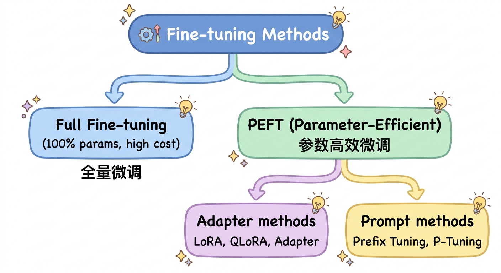
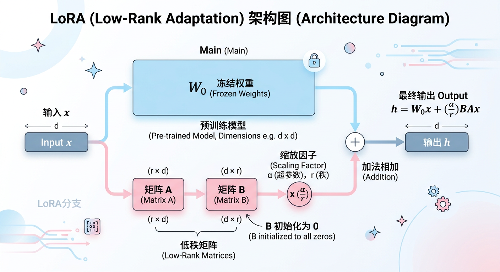
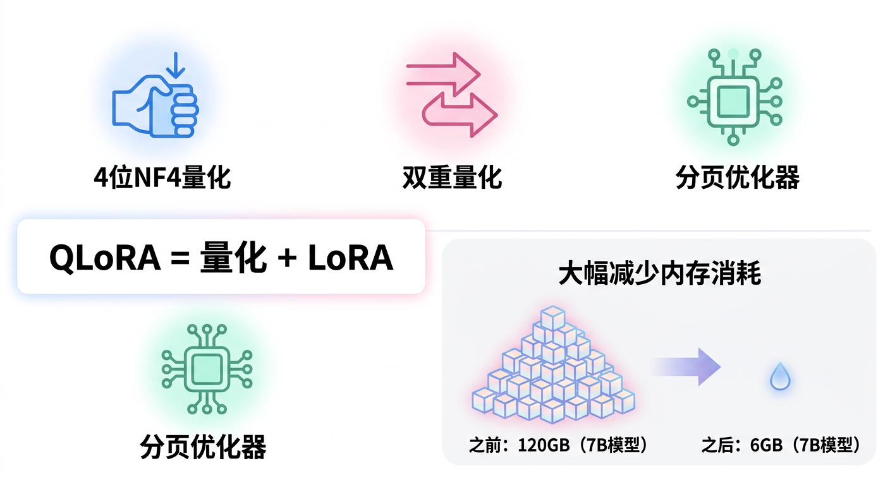

# 第六章：大模型微调技术

## 学习目标

完成本章学习后，你将能够：
- 理解全量微调与参数高效微调的区别
- 掌握LoRA、QLoRA、Adapter等主流微调方法
- 理解Prefix Tuning、P-Tuning等提示微调技术
- 熟悉指令微调（Instruction Tuning）的原理和实践

---

## 6.1 微调概述

### 为什么需要微调？

预训练大模型具有强大的通用能力，但：
- 缺乏特定领域知识
- 输出格式不符合需求
- 无法遵循特定指令
- 需要适应下游任务

### 微调方法分类



### 全量微调 vs PEFT

| 特性 | 全量微调 | PEFT |
|-----|---------|------|
| 可训练参数 | 100% | 0.1%-10% |
| 显存需求 | 非常高 | 低 |
| 训练速度 | 慢 | 快 |
| 存储成本 | 每任务一个模型 | 每任务一个小adapter |
| 灾难性遗忘 | 严重 | 轻微 |
| 效果 | 最好 | 接近全量 |

---

## 6.2 LoRA（Low-Rank Adaptation）

### 核心思想

**假设**：微调时的权重变化矩阵是低秩的

```
原始权重：W₀ ∈ ℝᵈˣᵈ
权重变化：ΔW = BA，其中 B ∈ ℝᵈˣʳ，A ∈ ℝʳˣᵈ，r << d

微调后：W = W₀ + ΔW = W₀ + BA

参数量：
- 原始：d × d = d²
- LoRA：d × r + r × d = 2dr
- 当r=8, d=4096时：压缩比 = d²/(2dr) = d/(2r) = 256倍
```

### LoRA结构图



### LoRA关键参数

| 参数 | 说明 | 推荐值 |
|-----|------|-------|
| r（秩） | 低秩矩阵的维度 | 8-64 |
| alpha | 缩放因子 | 通常等于r或2r |
| target_modules | 应用LoRA的层 | q_proj, v_proj等 |
| dropout | LoRA层的dropout | 0.05-0.1 |

### 代码示例

```python
from peft import LoraConfig, get_peft_model

# LoRA配置
lora_config = LoraConfig(
    r=8,                          # 秩
    lora_alpha=16,                # 缩放因子
    target_modules=["q_proj", "v_proj"],  # 目标模块
    lora_dropout=0.05,
    bias="none",
    task_type="CAUSAL_LM"
)

# 应用LoRA
model = get_peft_model(base_model, lora_config)

# 查看可训练参数
model.print_trainable_parameters()
# 输出：trainable params: 4,194,304 || all params: 6,742,609,920 || trainable%: 0.0622
```

### LoRA的应用位置

```
Transformer Block
├── Attention
│   ├── Q_proj  ← 推荐应用LoRA
│   ├── K_proj  ← 可选
│   ├── V_proj  ← 推荐应用LoRA
│   └── O_proj  ← 可选
└── FFN
    ├── up_proj   ← 可选
    ├── gate_proj ← 可选
    └── down_proj ← 可选

经验：只在Q和V上应用效果就很好
```

---

## 6.3 QLoRA（Quantized LoRA）

### 核心创新

在LoRA基础上引入量化，进一步减少显存：



### 显存对比

| 模型规模 | 全量微调 | LoRA | QLoRA |
|---------|---------|------|-------|
| 7B | 120GB+ | 50GB | 6GB |
| 13B | 200GB+ | 80GB | 10GB |
| 65B | 780GB+ | 300GB | 48GB |

### QLoRA代码示例

```python
from transformers import BitsAndBytesConfig
from peft import LoraConfig, get_peft_model, prepare_model_for_kbit_training

# 4-bit量化配置
bnb_config = BitsAndBytesConfig(
    load_in_4bit=True,
    bnb_4bit_quant_type="nf4",           # NormalFloat4
    bnb_4bit_compute_dtype=torch.bfloat16,
    bnb_4bit_use_double_quant=True,       # 双重量化
)

# 加载量化模型
model = AutoModelForCausalLM.from_pretrained(
    model_name,
    quantization_config=bnb_config,
    device_map="auto"
)

# 准备模型进行k-bit训练
model = prepare_model_for_kbit_training(model)

# 应用LoRA
lora_config = LoraConfig(
    r=16,
    lora_alpha=32,
    target_modules=["q_proj", "v_proj", "k_proj", "o_proj"],
    lora_dropout=0.05,
)
model = get_peft_model(model, lora_config)
```

---

## 6.4 Adapter方法

### Adapter Tuning

**原理**：在Transformer层之间插入小型adapter模块

```
┌───────────────────────────────────────────────────────────┐
│                    Adapter结构                             │
│                                                           │
│  原始Transformer层                                         │
│        │                                                  │
│        ↓                                                  │
│  ┌──────────┐                                            │
│  │ Attention │ （冻结）                                   │
│  └────┬─────┘                                            │
│       │                                                   │
│       ↓                                                   │
│  ┌──────────┐                                            │
│  │ Adapter  │ （可训练）                                  │
│  │Down→ReLU │                                            │
│  │  →Up    │                                             │
│  └────┬─────┘                                            │
│       │ + residual                                       │
│       ↓                                                   │
│  ┌──────────┐                                            │
│  │   FFN    │ （冻结）                                   │
│  └────┬─────┘                                            │
│       │                                                   │
│       ↓                                                   │
│  ┌──────────┐                                            │
│  │ Adapter  │ （可训练）                                  │
│  └────┬─────┘                                            │
│       │ + residual                                       │
│                                                           │
└───────────────────────────────────────────────────────────┘
```

### Adapter vs LoRA对比

| 特性 | Adapter | LoRA |
|-----|---------|------|
| 结构 | 串行插入 | 并行旁路 |
| 推理延迟 | 有额外计算 | 可合并到权重，无延迟 |
| 参数效率 | 较低 | 更高 |
| 多任务切换 | 需要切换模块 | 可直接融合或切换 |

### LoRA权重合并

```python
# LoRA的优势：推理时可合并权重
# W_merged = W₀ + (α/r) * B @ A

# PEFT库支持一键合并
merged_model = model.merge_and_unload()

# 合并后推理无额外开销
```

---

## 6.5 Prefix Tuning

### 核心思想

在输入前添加可学习的"虚拟token"

```
┌───────────────────────────────────────────────────────────┐
│                   Prefix Tuning                           │
│                                                           │
│  传统Fine-tuning：                                        │
│  [输入tokens] → [模型] → 输出                             │
│                                                           │
│  Prefix Tuning：                                          │
│  [可学习前缀][输入tokens] → [模型] → 输出                  │
│        ↑                                                  │
│   只训练这部分                                             │
│                                                           │
│  前缀直接添加到每一层的Key和Value：                         │
│  K' = [K_prefix; K_input]                                │
│  V' = [V_prefix; V_input]                                │
│                                                           │
└───────────────────────────────────────────────────────────┘
```

### 实现方式

```python
# Prefix Tuning的可学习参数
# 每一层都有独立的prefix向量

prefix_length = 20  # 前缀长度
num_layers = 32
hidden_size = 4096

# 可学习参数量
params = prefix_length * num_layers * hidden_size * 2  # K和V各一份
# 20 * 32 * 4096 * 2 = 5.2M 参数
```

---

## 6.6 P-Tuning系列

### P-Tuning v1

**思想**：用可学习的连续向量替代离散的prompt token

```
传统Prompt：
"请将以下句子翻译成英文：[输入]"

P-Tuning：
"[P₁][P₂][P₃]：[输入]"
   ↑ 可学习向量（非真实token）
```

### P-Tuning v2

**改进**：在每一层都添加可学习的prompt

```
┌───────────────────────────────────────────────────────────┐
│                     P-Tuning v2                           │
│                                                           │
│  Layer 0: [P⁰₁][P⁰₂]...[P⁰ₘ][输入tokens]                  │
│  Layer 1: [P¹₁][P¹₂]...[P¹ₘ][hidden states]               │
│  ...                                                      │
│  Layer L: [Pᴸ₁][Pᴸ₂]...[Pᴸₘ][hidden states]               │
│                                                           │
│  每一层都有独立的可学习prompt                               │
│  实际上等价于Prefix Tuning                                 │
│                                                           │
└───────────────────────────────────────────────────────────┘
```

### 方法对比

| 方法 | Prompt位置 | 参数量 | 效果 |
|-----|-----------|-------|------|
| Prompt Tuning | 仅输入层 | 最少 | 较弱 |
| P-Tuning v1 | 仅输入层+MLP | 少 | 中等 |
| P-Tuning v2/Prefix | 每层 | 较多 | 较好 |

---

## 6.7 指令微调（Instruction Tuning）

### 什么是指令微调？

让模型学会理解和遵循自然语言指令

```
┌───────────────────────────────────────────────────────────┐
│                   指令微调数据格式                          │
│                                                           │
│  {                                                        │
│    "instruction": "请将以下英文翻译成中文",                 │
│    "input": "Hello, how are you?",                       │
│    "output": "你好，你怎么样？"                             │
│  }                                                        │
│                                                           │
│  或者使用对话格式：                                         │
│  {                                                        │
│    "conversations": [                                     │
│      {"role": "user", "content": "请翻译：Hello"},        │
│      {"role": "assistant", "content": "你好"}             │
│    ]                                                      │
│  }                                                        │
│                                                           │
└───────────────────────────────────────────────────────────┘
```

### 指令微调数据集

| 数据集 | 规模 | 特点 |
|-------|------|------|
| FLAN | 1836任务 | 多任务指令数据 |
| Alpaca | 52K | GPT-4生成 |
| ShareGPT | 90K | 真实对话 |
| Dolly | 15K | 人工标注 |
| BELLE | 2M | 中文指令 |

### 指令模板

```python
# Alpaca格式
ALPACA_TEMPLATE = """Below is an instruction that describes a task. \
Write a response that appropriately completes the request.

### Instruction:
{instruction}

### Input:
{input}

### Response:
{output}"""

# ChatML格式
CHATML_TEMPLATE = """<|im_start|>system
{system_prompt}
<|im_end|>
<|im_start|>user
{user_input}
<|im_end|>
<|im_start|>assistant
{assistant_output}
<|im_end|>"""
```

### 训练Loss掩码

```
┌───────────────────────────────────────────────────────────┐
│                    Loss计算策略                            │
│                                                           │
│  输入：[指令部分][回答部分]                                 │
│  Loss：[  掩码  ][计算Loss]                                │
│                                                           │
│  只对模型回答部分计算Loss                                   │
│  指令部分不参与Loss计算                                     │
│                                                           │
│  代码实现：                                                │
│  labels = input_ids.clone()                              │
│  labels[:instruction_len] = -100  # 忽略指令部分           │
│                                                           │
└───────────────────────────────────────────────────────────┘
```

---

## 6.8 SFT训练实践

### 完整训练流程

```python
from transformers import Trainer, TrainingArguments
from peft import LoraConfig, get_peft_model

# 1. 加载基础模型
model = AutoModelForCausalLM.from_pretrained("meta-llama/Llama-2-7b-hf")
tokenizer = AutoTokenizer.from_pretrained("meta-llama/Llama-2-7b-hf")

# 2. 配置LoRA
lora_config = LoraConfig(
    r=16,
    lora_alpha=32,
    target_modules=["q_proj", "v_proj", "k_proj", "o_proj"],
    lora_dropout=0.05,
    task_type="CAUSAL_LM"
)
model = get_peft_model(model, lora_config)

# 3. 数据处理
def preprocess_function(examples):
    # 构造指令格式
    texts = [format_instruction(inst, inp, out)
             for inst, inp, out in zip(examples["instruction"],
                                       examples["input"],
                                       examples["output"])]
    return tokenizer(texts, truncation=True, max_length=512)

# 4. 训练配置
training_args = TrainingArguments(
    output_dir="./output",
    num_train_epochs=3,
    per_device_train_batch_size=4,
    gradient_accumulation_steps=4,
    learning_rate=2e-4,
    warmup_ratio=0.03,
    logging_steps=10,
    save_strategy="epoch",
    bf16=True,
)

# 5. 训练
trainer = Trainer(
    model=model,
    args=training_args,
    train_dataset=train_dataset,
    data_collator=data_collator,
)
trainer.train()
```

### 常见问题与解决

| 问题 | 原因 | 解决方案 |
|-----|------|---------|
| Loss不下降 | 学习率不合适 | 调整lr，通常2e-4到2e-5 |
| 过拟合 | 数据量少 | 增加dropout，使用更小的r |
| 回答重复 | 训练过度 | 减少epoch，增加多样性 |
| 格式混乱 | 模板不一致 | 统一数据格式和模板 |
| 显存OOM | batch太大 | 减小batch，增加梯度累积 |

---

## 6.9 微调方法选择指南

### 决策流程图

```
┌───────────────────────────────────────────────────────────┐
│                    微调方法选择                            │
│                                                           │
│  显存是否充足？                                            │
│       │                                                   │
│  ┌────┴────┐                                             │
│  ↓         ↓                                             │
│ 是        否                                              │
│  │         │                                             │
│  ↓         ↓                                             │
│ 全量微调  需要多少显存优化？                               │
│           │                                              │
│      ┌────┴────┐                                        │
│      ↓         ↓                                        │
│    中度      极致                                         │
│      │         │                                        │
│      ↓         ↓                                        │
│    LoRA     QLoRA                                       │
│                                                          │
│  是否需要推理无延迟？                                      │
│       │                                                  │
│  ┌────┴────┐                                            │
│  ↓         ↓                                            │
│ 是        否                                             │
│  │         │                                            │
│  ↓         ↓                                            │
│ LoRA    Adapter/Prefix                                  │
│                                                          │
└───────────────────────────────────────────────────────────┘
```

### 方法对比总结

| 方法 | 参数量 | 显存 | 效果 | 推理延迟 | 适用场景 |
|-----|-------|------|------|---------|---------|
| 全量微调 | 100% | 极高 | 最好 | 无 | 资源充足 |
| LoRA | 0.1-1% | 中 | 很好 | 可消除 | 通用推荐 |
| QLoRA | 0.1-1% | 低 | 好 | 有（量化） | 资源受限 |
| Adapter | 1-5% | 中 | 好 | 有 | 多任务 |
| Prefix | 0.1% | 低 | 较好 | 有 | 少量数据 |

---

## 6.10 本章小结

### 核心要点回顾

1. **PEFT优势**：参数高效微调大幅降低微调成本
2. **LoRA原理**：低秩分解假设，BA旁路结构
3. **QLoRA创新**：4-bit量化+LoRA，显存降低90%+
4. **指令微调**：让模型学会遵循指令，提升可用性
5. **选择策略**：根据资源和需求选择合适方法

### 微调最佳实践

```
1. 数据质量 > 数量
2. 统一使用一致的指令模板
3. 只对回答部分计算Loss
4. LoRA的r选择8-64通常足够
5. QLoRA适合消费级GPU
6. 训练后可合并LoRA权重消除延迟
```

---

## 延伸阅读

### 必读论文

1. **LoRA**: Low-Rank Adaptation of Large Language Models (Hu et al., 2021)
2. **QLoRA**: Efficient Finetuning of Quantized LLMs (Dettmers et al., 2023)
3. **Adapter**: Parameter-Efficient Transfer Learning (Houlsby et al., 2019)
4. **Prefix-Tuning**: Optimizing Continuous Prompts for Generation (Li & Liang, 2021)
5. **P-Tuning v2**: Prompt Tuning Can Be Comparable to Fine-tuning (Liu et al., 2022)

### 推荐资源

- [PEFT Documentation](https://huggingface.co/docs/peft)
- [LLaMA-Factory](https://github.com/hiyouga/LLaMA-Factory)
- [Axolotl](https://github.com/OpenAccess-AI-Collective/axolotl)

---

下一章：[第七章：RLHF与对齐技术](../第七章_RLHF与对齐技术/01_正文.md)
