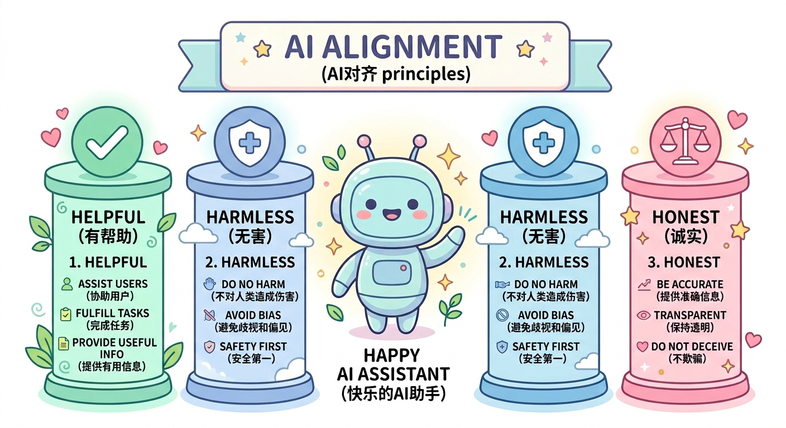
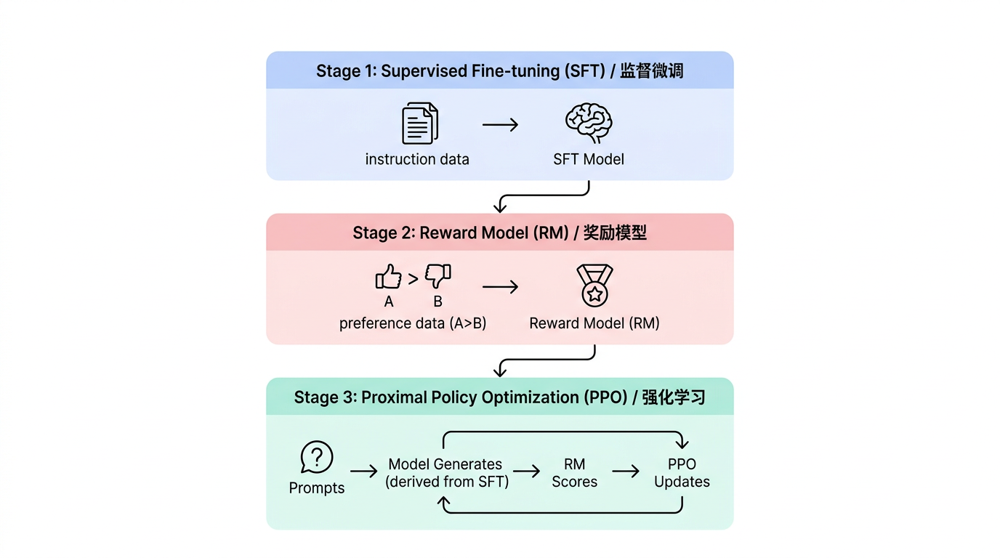
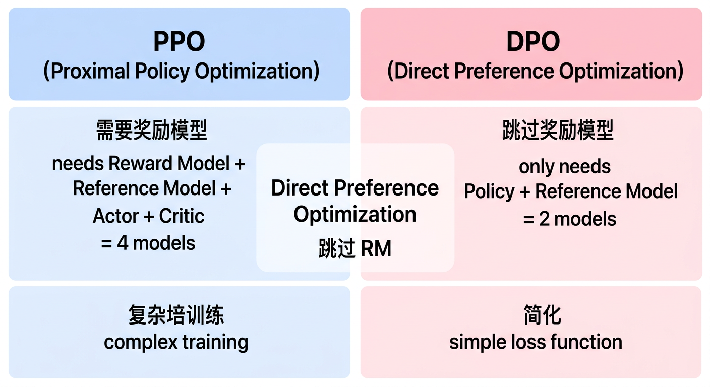

# 第七章：RLHF与对齐技术

## 学习目标

完成本章学习后，你将能够：
- 理解AI对齐问题的背景和重要性
- 掌握RLHF的完整流程和关键组件
- 理解奖励模型的训练方法
- 熟悉PPO、DPO、ORPO等对齐算法的原理

---

## 7.1 对齐问题概述

### 什么是AI对齐？



### 为什么需要对齐？

预训练模型的问题：
- **幻觉**：编造不存在的事实
- **有害内容**：可能生成不当内容
- **不遵循指令**：难以准确理解用户意图
- **缺乏边界**：不知道什么不该回答

### 对齐技术演进

```
预训练模型
    │
    ↓ SFT（监督微调）
指令微调模型
    │
    ↓ RLHF/DPO/ORPO（偏好对齐）
对齐模型（如ChatGPT）
```

---

## 7.2 RLHF完整流程

### 三阶段训练



### RLHF流程图

```
              阶段1: SFT
              ┌─────────┐
指令数据 ───→ │ 基础模型 │ ───→ SFT模型
              └─────────┘

              阶段2: 奖励模型
              ┌─────────┐
偏好数据 ───→ │ SFT模型 │ ───→ 奖励模型(RM)
(A>B)         └─────────┘

              阶段3: PPO
              ┌─────────┐
提示词  ───→  │ SFT模型 │ ───→ 生成回答
              └────┬────┘
                   │
                   ↓
              ┌─────────┐
              │ 奖励模型 │ ───→ 奖励分数
              └────┬────┘
                   │
                   ↓
              ┌─────────┐
              │  PPO    │ ───→ 更新策略
              │ 优化器  │
              └─────────┘
```

---

## 7.3 奖励模型（Reward Model）

### 偏好数据收集

```
┌───────────────────────────────────────────────────────────┐
│                    偏好数据格式                            │
│                                                           │
│  Prompt: "请解释量子计算的基本原理"                         │
│                                                           │
│  Response A:                                              │
│  "量子计算利用量子比特（qubit）的叠加态和纠缠态..."         │
│                                                           │
│  Response B:                                              │
│  "量子计算就是很快的计算机..."                              │
│                                                           │
│  人类标注: A > B（A比B更好）                               │
│                                                           │
└───────────────────────────────────────────────────────────┘
```

### 奖励模型训练

**目标**：学习预测人类偏好

```
损失函数：Bradley-Terry Model

L = -log(σ(r(x, y_w) - r(x, y_l)))

其中：
- x: prompt
- y_w: 被选中的回答（winner）
- y_l: 被拒绝的回答（loser）
- r(x, y): 奖励模型给出的分数
- σ: sigmoid函数
```

**训练代码示例**：

```python
class RewardModel(nn.Module):
    def __init__(self, base_model):
        super().__init__()
        self.model = base_model
        # 添加一个线性层输出标量奖励
        self.reward_head = nn.Linear(hidden_size, 1)

    def forward(self, input_ids, attention_mask):
        outputs = self.model(input_ids, attention_mask=attention_mask)
        # 取最后一个token的hidden state
        last_hidden = outputs.last_hidden_state[:, -1, :]
        reward = self.reward_head(last_hidden)
        return reward

def compute_loss(model, batch):
    # 计算chosen和rejected的奖励
    r_chosen = model(batch["chosen_ids"], batch["chosen_mask"])
    r_rejected = model(batch["rejected_ids"], batch["rejected_mask"])

    # Bradley-Terry损失
    loss = -torch.log(torch.sigmoid(r_chosen - r_rejected)).mean()
    return loss
```

### 奖励模型评估

| 指标 | 说明 |
|-----|------|
| 准确率 | r(chosen) > r(rejected)的比例 |
| AUC | ROC曲线下面积 |
| 一致性 | 与人类标注的一致率 |

---

## 7.4 PPO算法详解

### PPO原理

```
┌───────────────────────────────────────────────────────────┐
│              Proximal Policy Optimization                 │
│                                                           │
│  核心思想：                                                │
│  1. 限制每次更新的幅度，保证训练稳定                        │
│  2. 使用importance sampling处理off-policy数据             │
│  3. 使用clipping防止更新过大                               │
│                                                           │
│  优化目标：                                                │
│  L^CLIP = E[min(r_t(θ)·A_t, clip(r_t(θ), 1-ε, 1+ε)·A_t)] │
│                                                           │
│  其中：                                                    │
│  r_t(θ) = π_θ(a|s) / π_θ_old(a|s)  (概率比)               │
│  A_t: 优势函数                                            │
│  ε: clipping参数，通常0.1-0.2                             │
│                                                           │
└───────────────────────────────────────────────────────────┘
```

### RLHF中的PPO

**完整目标函数**：

```
目标 = E[r(x, y)] - β·KL[π_θ(y|x) || π_ref(y|x)]

其中：
- r(x, y): 奖励模型给出的奖励
- β: KL惩罚系数
- π_θ: 当前策略（正在训练的模型）
- π_ref: 参考策略（SFT模型，冻结）

KL惩罚的作用：
- 防止模型偏离SFT太远
- 保持语言生成能力
- 避免reward hacking
```

### PPO训练流程

```python
# PPO训练伪代码
for epoch in range(num_epochs):
    for batch in dataloader:
        prompts = batch["prompts"]

        # 1. 用当前策略生成回答
        responses = policy_model.generate(prompts)

        # 2. 计算奖励
        rewards = reward_model(prompts, responses)

        # 3. 计算KL惩罚
        with torch.no_grad():
            ref_logprobs = ref_model.log_prob(prompts, responses)
        policy_logprobs = policy_model.log_prob(prompts, responses)
        kl = policy_logprobs - ref_logprobs

        # 4. 计算总奖励
        total_reward = rewards - beta * kl

        # 5. 计算优势函数
        advantages = compute_advantages(total_reward, values)

        # 6. PPO更新
        for _ in range(ppo_epochs):
            # 计算概率比
            ratio = torch.exp(new_logprobs - old_logprobs)
            # Clipped目标
            surr1 = ratio * advantages
            surr2 = torch.clamp(ratio, 1-eps, 1+eps) * advantages
            loss = -torch.min(surr1, surr2).mean()

            optimizer.zero_grad()
            loss.backward()
            optimizer.step()
```

### PPO训练挑战

| 挑战 | 原因 | 解决方案 |
|-----|------|---------|
| 训练不稳定 | 奖励稀疏、方差大 | 使用GAE、调整β |
| Reward Hacking | 模型找到漏洞骗奖励 | 增大KL惩罚、改进RM |
| 计算开销大 | 需要多个模型 | 模型共享、梯度检查点 |
| 超参敏感 | PPO参数多 | 仔细调参、参考经验值 |

---

## 7.5 DPO：直接偏好优化

### 动机

```
PPO的问题：
1. 需要单独训练奖励模型
2. 训练过程复杂，需要多个模型
3. 计算开销大
4. 超参数敏感

DPO的解决方案：
直接从偏好数据学习，跳过奖励模型训练
```

### DPO原理



**DPO关键洞察**：最优策略可以用奖励函数表示，通过数学推导可以跳过奖励模型，直接从偏好数据学习。

### DPO损失函数

```python
def dpo_loss(policy_model, ref_model, batch, beta=0.1):
    """
    DPO损失计算
    """
    # 计算policy模型的log概率
    policy_chosen_logps = get_log_probs(policy_model, batch["chosen"])
    policy_rejected_logps = get_log_probs(policy_model, batch["rejected"])

    # 计算reference模型的log概率
    with torch.no_grad():
        ref_chosen_logps = get_log_probs(ref_model, batch["chosen"])
        ref_rejected_logps = get_log_probs(ref_model, batch["rejected"])

    # 计算log ratio
    chosen_logratios = policy_chosen_logps - ref_chosen_logps
    rejected_logratios = policy_rejected_logps - ref_rejected_logps

    # DPO损失
    losses = -F.logsigmoid(beta * (chosen_logratios - rejected_logratios))
    return losses.mean()
```

### DPO vs PPO对比

| 特性 | PPO (RLHF) | DPO |
|-----|-----------|-----|
| 奖励模型 | 需要 | 不需要 |
| 训练阶段 | 3阶段 | 2阶段 |
| 模型数量 | 4个（actor, critic, RM, ref） | 2个（policy, ref） |
| 计算开销 | 高 | 低 |
| 实现复杂度 | 复杂 | 简单 |
| 在线采样 | 需要 | 不需要 |
| 效果 | 略好 | 接近 |

### DPO训练示例

```python
from trl import DPOTrainer, DPOConfig

# DPO配置
dpo_config = DPOConfig(
    beta=0.1,                    # KL惩罚系数
    learning_rate=5e-7,
    per_device_train_batch_size=4,
    gradient_accumulation_steps=4,
    max_length=1024,
    max_prompt_length=512,
)

# 准备数据集（需要chosen和rejected字段）
# dataset格式: {"prompt": ..., "chosen": ..., "rejected": ...}

# 初始化训练器
trainer = DPOTrainer(
    model=model,
    ref_model=ref_model,       # 参考模型（冻结）
    args=dpo_config,
    train_dataset=train_dataset,
    tokenizer=tokenizer,
)

# 训练
trainer.train()
```

---

## 7.6 ORPO：无需参考模型的对齐

### ORPO原理

```
┌───────────────────────────────────────────────────────────┐
│          Odds Ratio Preference Optimization               │
│                                                           │
│  创新点：                                                  │
│  1. 不需要参考模型（π_ref）                                │
│  2. 将SFT和偏好学习合并为一个阶段                          │
│  3. 使用odds ratio代替log ratio                           │
│                                                           │
│  Odds定义：                                                │
│  odds(y|x) = P(y|x) / (1 - P(y|x))                       │
│                                                           │
│  ORPO损失：                                                │
│  L = L_SFT + λ·L_OR                                      │
│                                                           │
│  L_SFT = -log P(y_w|x)                                   │
│  L_OR = -log σ(log(odds(y_w|x)/odds(y_l|x)))            │
│                                                           │
└───────────────────────────────────────────────────────────┘
```

### 为什么ORPO不需要参考模型？

```
DPO需要参考模型的原因：
- 限制策略不要偏离太远
- 使用log ratio：log(π_θ/π_ref)

ORPO的思路：
- 使用odds ratio自带正则化效果
- SFT损失本身保证基本能力
- odds ratio在对数空间有界

结果：
- 训练更简单
- 显存更省（少一个模型）
- 效果接近甚至更好
```

### ORPO代码示例

```python
from trl import ORPOTrainer, ORPOConfig

# ORPO配置
orpo_config = ORPOConfig(
    learning_rate=8e-6,
    beta=0.1,                    # odds ratio权重
    per_device_train_batch_size=2,
    gradient_accumulation_steps=4,
    max_length=1024,
    max_prompt_length=512,
    num_train_epochs=1,
)

# 训练器（不需要ref_model）
trainer = ORPOTrainer(
    model=model,
    args=orpo_config,
    train_dataset=train_dataset,
    tokenizer=tokenizer,
)

trainer.train()
```

---

## 7.7 其他对齐方法

### IPO（Identity Preference Optimization）

```
DPO的改进版本
解决DPO在某些情况下的过拟合问题

损失函数：
L_IPO = (log(π(y_w|x)/π_ref(y_w|x))
        - log(π(y_l|x)/π_ref(y_l|x)) - 1/2β)²
```

### KTO（Kahneman-Tversky Optimization）

```
基于前景理论（Prospect Theory）
只需要二元反馈（好/坏），不需要成对比较

优势：
- 数据需求更简单
- 不需要同一prompt的两个回答
```

### SimPO（Simple Preference Optimization）

```
进一步简化DPO
使用平均log概率代替总log概率
加入长度归一化

优势：
- 减少长度偏见
- 更稳定的训练
```

### 方法对比

| 方法 | 参考模型 | 数据格式 | 复杂度 | 特点 |
|-----|---------|---------|-------|------|
| PPO | 需要RM+ref | prompt+response | 最高 | 效果最好，最复杂 |
| DPO | 需要ref | 成对偏好 | 中等 | 简单有效 |
| ORPO | 不需要 | 成对偏好 | 低 | 最简单 |
| KTO | 需要ref | 二元反馈 | 中等 | 数据简单 |

---

## 7.8 对齐训练实践

### 数据准备

```python
# 偏好数据格式
preference_data = [
    {
        "prompt": "请解释机器学习中的过拟合问题",
        "chosen": "过拟合是指模型在训练数据上表现很好...",
        "rejected": "过拟合就是学太多了..."
    },
    # ...
]

# 数据质量要点
# 1. chosen确实比rejected好
# 2. 涵盖多种场景
# 3. 差异要明显
# 4. 数量足够（通常10K+）
```

### 超参数调优

| 参数 | DPO推荐值 | ORPO推荐值 | 说明 |
|-----|---------|----------|------|
| beta | 0.1-0.5 | 0.1 | 偏好强度 |
| learning_rate | 5e-7 | 8e-6 | ORPO可以用更大lr |
| batch_size | 4-8 | 2-4 | 根据显存调整 |
| max_length | 1024-2048 | 1024-2048 | 序列长度 |
| epochs | 1-3 | 1 | 通常1个epoch足够 |

### 训练监控

```python
# 关键指标
metrics = {
    "loss": ...,
    "rewards/chosen": ...,      # chosen的隐式奖励
    "rewards/rejected": ...,    # rejected的隐式奖励
    "rewards/margins": ...,     # 两者差距
    "logps/chosen": ...,        # chosen的log概率
    "logps/rejected": ...,      # rejected的log概率
}

# 健康的训练：
# - rewards/margins应该增大
# - logps/chosen应该增大
# - logps/rejected应该减小
```

---

## 7.9 本章小结

### 核心要点回顾

1. **对齐目标**：让AI输出符合人类价值观（HHH原则）
2. **RLHF流程**：SFT → 奖励模型 → PPO优化
3. **奖励模型**：学习人类偏好，提供奖励信号
4. **PPO**：通过强化学习优化策略，需要KL约束
5. **DPO**：直接从偏好学习，跳过奖励模型
6. **ORPO**：不需要参考模型，最简单的方案

### 方法选择建议

```
资源充足，追求最好效果 → PPO
平衡效果和复杂度 → DPO
资源有限，快速迭代 → ORPO
只有二元反馈数据 → KTO
```

---

## 延伸阅读

### 必读论文

1. **InstructGPT**: Training language models to follow instructions (OpenAI, 2022)
2. **RLHF**: Learning to summarize from human feedback (Stiennon et al., 2020)
3. **DPO**: Direct Preference Optimization (Rafailov et al., 2023)
4. **ORPO**: Monolithic Preference Optimization without Reference Model (Hong et al., 2024)
5. **Constitutional AI**: Training a Harmless AI Assistant (Anthropic, 2022)

### 推荐资源

- [TRL Documentation](https://huggingface.co/docs/trl)
- [OpenAI Alignment Research](https://openai.com/research/instruction-following)
- [Anthropic Research](https://www.anthropic.com/research)

---

下一章：[第八章：推理优化与部署](../第八章_推理优化与部署/01_正文.md)
