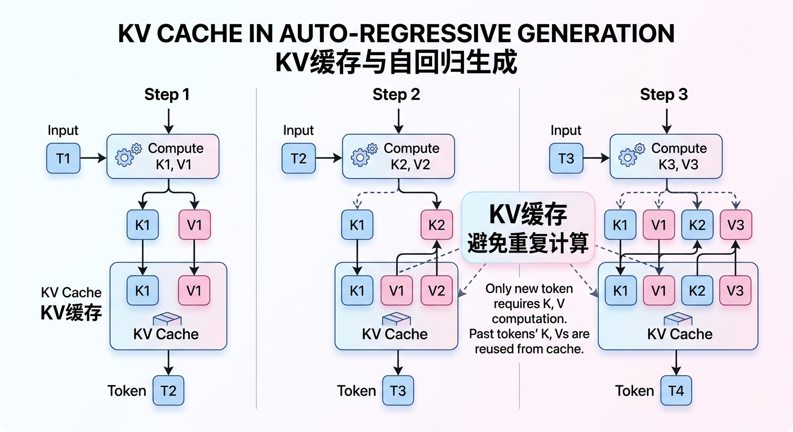
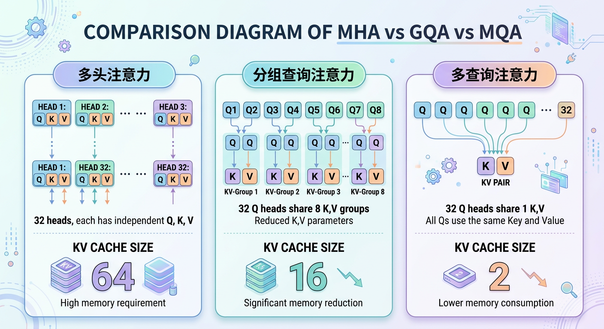
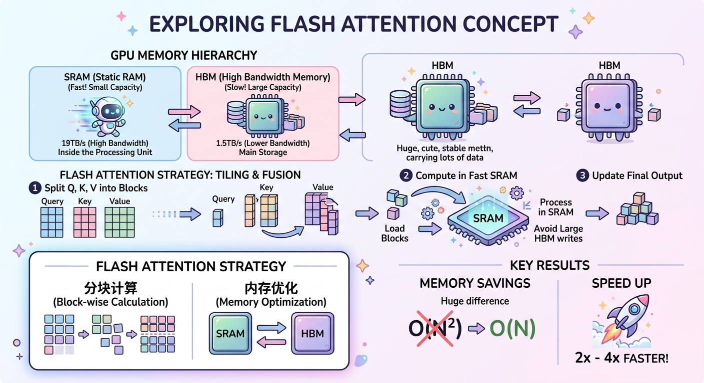

# 第八章：推理优化与部署

## 学习目标

完成本章学习后，你将能够：
- 理解大模型推理的性能瓶颈
- 掌握量化技术（INT8/INT4/GPTQ/AWQ）的原理
- 理解KV Cache、Flash Attention等优化技术
- 熟悉vLLM等高性能推理框架的使用

---

## 8.1 推理性能分析

### 大模型推理的特点

```
┌───────────────────────────────────────────────────────────┐
│                    LLM推理特点                             │
│                                                           │
│  1. 自回归生成                                             │
│     - 逐token生成，无法并行                                │
│     - 每个token都需要前向传播                              │
│                                                           │
│  2. 内存带宽受限                                           │
│     - 大量参数需要从显存读取                               │
│     - 计算强度低，内存带宽是瓶颈                           │
│                                                           │
│  3. 两阶段特性                                             │
│     - Prefill阶段：处理输入prompt（计算密集）               │
│     - Decode阶段：逐token生成（内存密集）                   │
│                                                           │
└───────────────────────────────────────────────────────────┘
```

### 推理性能指标

| 指标 | 定义 | 影响因素 |
|-----|------|---------|
| Latency | 首token延迟 | Prefill速度 |
| Throughput | 每秒生成token数 | Decode效率 |
| TTFT | Time To First Token | 输入处理速度 |
| TPS | Tokens Per Second | 批处理效率 |

### 性能瓶颈分析

```
推理过程：

输入prompt（100 tokens）
     │
     ↓ Prefill阶段
处理所有输入tokens（计算密集，可并行）
     │
     ↓
生成token 1
     │ ← Decode阶段
生成token 2     （内存密集，串行）
     │
    ...
     │
生成token N

瓶颈：
- Prefill：计算瓶颈，GPU利用率高
- Decode：内存带宽瓶颈，GPU利用率低
```

---

## 8.2 模型量化

### 量化基础

**什么是量化**：将高精度浮点数（FP32/FP16）转换为低精度整数（INT8/INT4）

```
┌───────────────────────────────────────────────────────────┐
│                      量化原理                              │
│                                                           │
│  FP16 → INT8 量化：                                       │
│                                                           │
│  x_int8 = round(x_fp16 / scale) + zero_point             │
│  x_fp16 = (x_int8 - zero_point) * scale                  │
│                                                           │
│  其中：                                                    │
│  - scale: 缩放因子                                        │
│  - zero_point: 零点偏移                                   │
│                                                           │
└───────────────────────────────────────────────────────────┘
```

### 量化类型对比

| 类型 | 位数 | 内存压缩 | 精度损失 | 推理加速 |
|-----|------|---------|---------|---------|
| FP16 | 16 | 2× | 无 | 基准 |
| INT8 | 8 | 4× | 很小 | 1.5-2× |
| INT4 | 4 | 8× | 较小 | 2-3× |
| INT3/2 | 3/2 | 10-16× | 较大 | 更快 |

### 量化粒度

```
┌───────────────────────────────────────────────────────────┐
│                      量化粒度                              │
│                                                           │
│  Per-tensor：整个张量共享一个scale                         │
│  ├── 最简单，但精度损失大                                  │
│                                                           │
│  Per-channel：每个输出通道一个scale                        │
│  ├── 精度更好，推荐用于权重                                │
│                                                           │
│  Per-group：每组元素一个scale                              │
│  ├── GPTQ/AWQ使用，精度最好                               │
│  └── 如每128个元素一个scale                                │
│                                                           │
└───────────────────────────────────────────────────────────┘
```

---

## 8.3 GPTQ量化

### GPTQ原理

```
GPTQ (GPT Quantization)：基于二阶信息的后训练量化

核心思想：
1. 逐层量化，考虑量化误差传播
2. 使用Hessian矩阵指导量化顺序
3. 通过校准数据集优化量化参数

目标：最小化量化后的输出误差
min_Q ||WX - Q(W)X||²
```

### GPTQ算法流程

```python
# GPTQ伪代码
def gptq_quantize(W, X, bits=4):
    """
    W: 权重矩阵 [out_dim, in_dim]
    X: 校准数据
    """
    # 计算Hessian矩阵
    H = X @ X.T  # [in_dim, in_dim]

    # 逐列量化
    for i in range(in_dim):
        # 量化第i列
        q_i = quantize(W[:, i], bits)
        # 计算量化误差
        error = W[:, i] - q_i
        # 用Hessian信息补偿后续列
        W[:, i+1:] -= error.outer(H[i, i+1:] / H[i, i])

    return Q(W)
```

### GPTQ使用示例

```python
from transformers import AutoModelForCausalLM, GPTQConfig

# GPTQ配置
gptq_config = GPTQConfig(
    bits=4,                    # 量化位数
    group_size=128,           # 分组大小
    dataset="c4",             # 校准数据集
    desc_act=True,            # 按激活值重排
)

# 量化模型
model = AutoModelForCausalLM.from_pretrained(
    "meta-llama/Llama-2-7b-hf",
    quantization_config=gptq_config,
    device_map="auto"
)

# 保存量化模型
model.save_pretrained("llama-2-7b-gptq")
```

---

## 8.4 AWQ量化

### AWQ原理

```
AWQ (Activation-aware Weight Quantization)：激活感知的权重量化

核心发现：
1. 只有少量权重对激活值影响很大（显著权重）
2. 保护这些显著权重可以大幅减少量化误差
3. 不需要重新训练，只需要少量校准数据

方法：
根据激活值的重要性调整权重的scale
```

### AWQ vs GPTQ对比

| 特性 | GPTQ | AWQ |
|-----|------|-----|
| 量化方式 | 误差补偿 | 显著权重保护 |
| 校准数据 | 需要 | 需要（更少） |
| 量化速度 | 较慢 | 较快 |
| 精度 | 很好 | 更好 |
| 推理速度 | 快 | 更快 |

### AWQ使用示例

```python
from awq import AutoAWQForCausalLM

# 加载模型
model = AutoAWQForCausalLM.from_pretrained(
    "meta-llama/Llama-2-7b-hf"
)

# AWQ量化
model.quantize(
    tokenizer,
    quant_config={
        "w_bit": 4,
        "q_group_size": 128,
        "zero_point": True,
    }
)

# 保存
model.save_quantized("llama-2-7b-awq")
```

---

## 8.5 KV Cache优化

### KV Cache原理



### KV Cache内存计算

```
KV Cache内存 = 2 × num_layers × batch_size × seq_len × hidden_size × precision

示例（LLaMA-7B, FP16）：
- num_layers = 32
- hidden_size = 4096
- batch_size = 1
- seq_len = 2048

KV Cache = 2 × 32 × 1 × 2048 × 4096 × 2 bytes
        = 1GB

问题：长上下文+大batch时，KV Cache显存爆炸
```

### KV Cache优化技术

```
┌───────────────────────────────────────────────────────────┐
│                KV Cache优化方法                            │
│                                                           │
│  1. Paged Attention (vLLM)                               │
│     - 将KV Cache分页管理                                  │
│     - 动态分配，减少碎片                                   │
│     - 支持更大batch                                       │
│                                                           │
│  2. MQA/GQA                                              │
│     - Multi-Query Attention：多头共享K,V                  │
│     - Group-Query Attention：分组共享K,V                  │
│     - 大幅减少KV Cache大小                                │
│                                                           │
│  3. KV Cache量化                                          │
│     - 将KV Cache量化到INT8/INT4                          │
│     - 减少内存但保持精度                                   │
│                                                           │
│  4. Sliding Window                                        │
│     - 只保留最近的K,V                                     │
│     - 适合Mistral等模型                                   │
│                                                           │
└───────────────────────────────────────────────────────────┘
```

### GQA详解



---

## 8.6 Flash Attention

### 标准Attention的问题

```
Attention计算：
O = softmax(QK^T / √d) × V

问题：
1. QK^T是N×N矩阵，内存占用O(N²)
2. 需要将整个矩阵写入HBM（高带宽内存）
3. 长序列时内存爆炸

例如：seq_len=4096, FP16
QK^T矩阵 = 4096 × 4096 × 2 bytes = 32MB/head
32头 = 1GB/layer
```

### Flash Attention原理



### Flash Attention算法

```python
# Flash Attention伪代码
def flash_attention(Q, K, V, block_size):
    """
    分块计算Attention
    """
    N = Q.shape[0]
    O = zeros_like(Q)
    L = zeros(N)  # softmax分母

    # 分块遍历
    for i in range(0, N, block_size):
        Q_block = Q[i:i+block_size]
        o_block = zeros_like(Q_block)
        l_block = zeros(block_size)

        for j in range(0, N, block_size):
            K_block = K[j:j+block_size]
            V_block = V[j:j+block_size]

            # 在SRAM中计算
            S = Q_block @ K_block.T / sqrt(d)
            P = exp(S)
            o_block += P @ V_block
            l_block += P.sum(dim=-1)

        O[i:i+block_size] = o_block / l_block

    return O
```

### Flash Attention使用

```python
# PyTorch 2.0+ 内置
import torch.nn.functional as F

# 自动使用Flash Attention（如果可用）
output = F.scaled_dot_product_attention(
    query, key, value,
    attn_mask=None,
    dropout_p=0.0,
    is_causal=True  # causal attention
)

# 或使用flash-attn库
from flash_attn import flash_attn_func

output = flash_attn_func(
    q, k, v,
    causal=True,
    softmax_scale=1/sqrt(d)
)
```

---

## 8.7 vLLM推理框架

### vLLM特点

```
┌───────────────────────────────────────────────────────────┐
│                      vLLM特性                              │
│                                                           │
│  1. PagedAttention                                        │
│     - KV Cache分页管理                                    │
│     - 类似操作系统虚拟内存                                 │
│     - 减少内存碎片，提高利用率                             │
│                                                           │
│  2. Continuous Batching                                   │
│     - 动态批处理                                          │
│     - 请求完成立即释放，新请求立即加入                      │
│     - 提高吞吐量                                          │
│                                                           │
│  3. 高效采样                                              │
│     - 并行采样多个序列                                    │
│     - Beam search优化                                     │
│                                                           │
│  4. 量化支持                                              │
│     - AWQ, GPTQ, INT8等                                  │
│                                                           │
└───────────────────────────────────────────────────────────┘
```

### PagedAttention原理

```
传统方式：
为每个请求预分配最大长度的KV Cache
实际使用可能很少，造成浪费

PagedAttention：
├── 将KV Cache分成固定大小的页（如16 tokens）
├── 动态分配页，按需扩展
├── 请求结束释放页，可被其他请求复用
└── 类似操作系统的虚拟内存管理

效果：
- 内存利用率从30%提高到90%+
- 支持更大的并发batch
```

### vLLM使用示例

```python
from vllm import LLM, SamplingParams

# 初始化模型
llm = LLM(
    model="meta-llama/Llama-2-7b-chat-hf",
    tensor_parallel_size=1,          # 张量并行
    dtype="float16",
    quantization="awq",              # 可选量化
)

# 采样参数
sampling_params = SamplingParams(
    temperature=0.8,
    top_p=0.95,
    max_tokens=256,
)

# 批量推理
prompts = [
    "What is the capital of France?",
    "Explain quantum computing in simple terms.",
]
outputs = llm.generate(prompts, sampling_params)

for output in outputs:
    print(output.outputs[0].text)
```

### vLLM API服务

```python
# 启动API服务
# python -m vllm.entrypoints.openai.api_server \
#     --model meta-llama/Llama-2-7b-chat-hf \
#     --port 8000

# 客户端调用（兼容OpenAI API）
import openai

client = openai.OpenAI(
    base_url="http://localhost:8000/v1",
    api_key="not-needed"
)

response = client.chat.completions.create(
    model="meta-llama/Llama-2-7b-chat-hf",
    messages=[
        {"role": "user", "content": "Hello!"}
    ]
)
print(response.choices[0].message.content)
```

---

## 8.8 其他推理优化

### Speculative Decoding（推测解码）

```
┌───────────────────────────────────────────────────────────┐
│                   推测解码                                 │
│                                                           │
│  核心思想：用小模型草稿，大模型验证                         │
│                                                           │
│  流程：                                                    │
│  1. 小模型（draft）快速生成K个token                        │
│  2. 大模型（target）一次前向验证所有K个token               │
│  3. 接受匹配的token，拒绝不匹配的                          │
│  4. 从第一个不匹配处继续                                   │
│                                                           │
│  效果：                                                    │
│  - 无损加速                                               │
│  - 加速比取决于接受率                                      │
│  - 通常1.5-3×加速                                         │
│                                                           │
└───────────────────────────────────────────────────────────┘
```

### 模型并行推理

```
张量并行（Tensor Parallelism）：
- 单层分布到多GPU
- 适合大模型单次推理

流水线并行（Pipeline Parallelism）：
- 不同层在不同GPU
- 适合长序列批处理

数据并行：
- 同一模型复制多份
- 处理不同请求
- 简单，适合高吞吐场景
```

### 推理框架对比

| 框架 | 特点 | 适用场景 |
|-----|------|---------|
| vLLM | PagedAttention, 高吞吐 | 在线服务 |
| TGI | HuggingFace官方 | 生产部署 |
| TensorRT-LLM | NVIDIA优化 | 最高性能 |
| llama.cpp | CPU/移动端 | 边缘部署 |
| Ollama | 简单易用 | 本地体验 |

---

## 8.9 部署最佳实践

### 部署配置选择

```
┌───────────────────────────────────────────────────────────┐
│                   部署配置指南                             │
│                                                           │
│  根据模型大小选择：                                        │
│                                                           │
│  7B模型：                                                 │
│  ├── FP16: 1×A100 40GB                                   │
│  ├── INT8: 1×RTX 3090 24GB                               │
│  └── INT4: 1×RTX 3060 12GB                               │
│                                                           │
│  13B模型：                                                │
│  ├── FP16: 1×A100 80GB                                   │
│  ├── INT8: 1×A100 40GB                                   │
│  └── INT4: 1×RTX 4090 24GB                               │
│                                                           │
│  70B模型：                                                │
│  ├── FP16: 2×A100 80GB                                   │
│  ├── INT8: 1×A100 80GB                                   │
│  └── INT4: 1×A100 40GB                                   │
│                                                           │
└───────────────────────────────────────────────────────────┘
```

### 性能调优checklist

```
1. 量化选择
   □ 评估精度需求
   □ 选择合适的量化方法（AWQ/GPTQ）
   □ 验证量化后精度

2. 批处理优化
   □ 启用continuous batching
   □ 调整max_batch_size
   □ 监控GPU利用率

3. 内存优化
   □ 使用KV Cache量化
   □ 调整max_context_length
   □ 监控显存使用

4. 并行策略
   □ 根据模型大小选择并行方式
   □ 合理设置tensor_parallel_size
   □ 考虑请求特点

5. 监控告警
   □ 设置延迟告警
   □ 监控吞吐量
   □ 追踪错误率
```

---

## 8.10 本章小结

### 核心要点回顾

1. **推理瓶颈**：Prefill计算密集，Decode内存密集
2. **量化技术**：GPTQ/AWQ实现4-bit量化，显存降4×+
3. **KV Cache**：GQA减少缓存，分页管理提高利用率
4. **Flash Attention**：分块计算，内存O(N²)→O(N)
5. **vLLM**：PagedAttention+Continuous Batching

### 优化效果总结

| 技术 | 显存优化 | 速度优化 | 精度影响 |
|-----|---------|---------|---------|
| INT8量化 | 2× | 1.5× | 很小 |
| INT4量化 | 4× | 2× | 小 |
| Flash Attention | 显著 | 2-4× | 无 |
| GQA | 4×(KV Cache) | - | 很小 |
| PagedAttention | 3×(利用率) | - | 无 |

---

## 延伸阅读

### 必读论文

1. **GPTQ**: Accurate Post-Training Quantization for Generative Pre-trained Transformers
2. **AWQ**: Activation-aware Weight Quantization
3. **Flash Attention**: Fast and Memory-Efficient Exact Attention
4. **vLLM**: Efficient Memory Management for Large Language Model Serving
5. **Speculative Decoding**: Fast Inference from Transformers via Speculative Decoding

### 推荐资源

- [vLLM Documentation](https://docs.vllm.ai/)
- [TensorRT-LLM](https://github.com/NVIDIA/TensorRT-LLM)
- [llama.cpp](https://github.com/ggerganov/llama.cpp)

---

下一章：[第九章：RAG与Agent应用](../第九章_RAG与Agent应用/01_正文.md)
