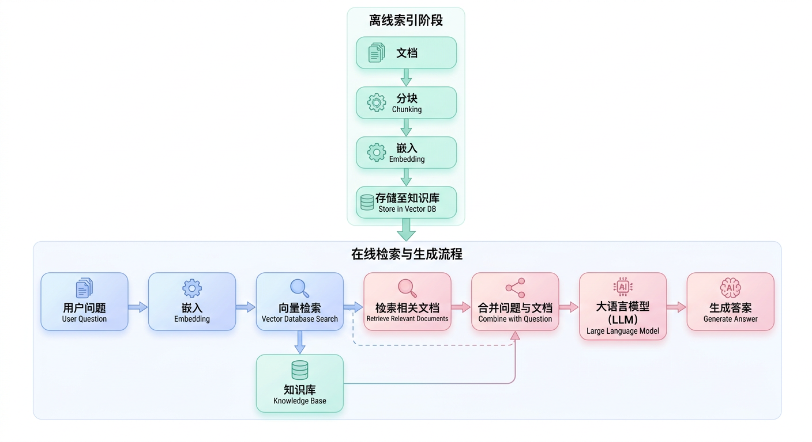
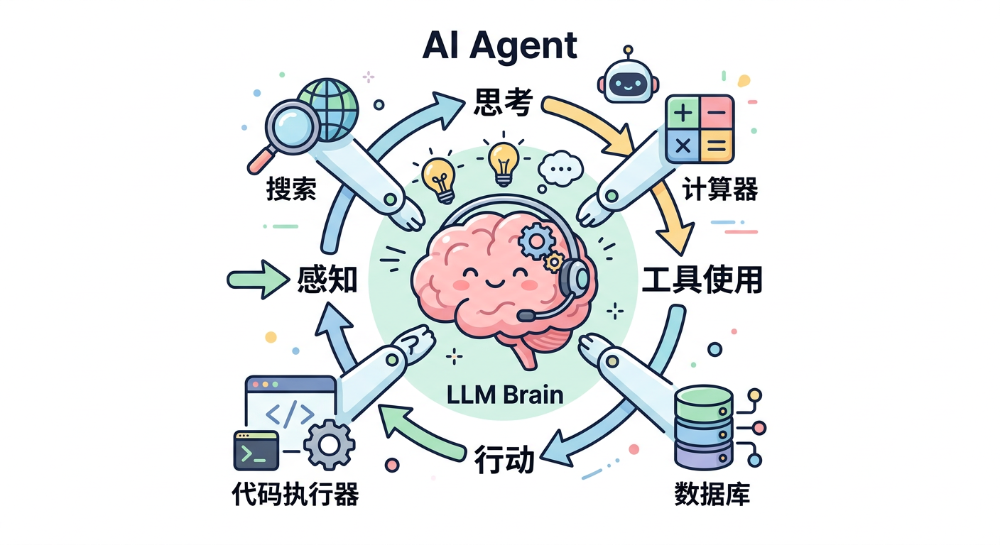
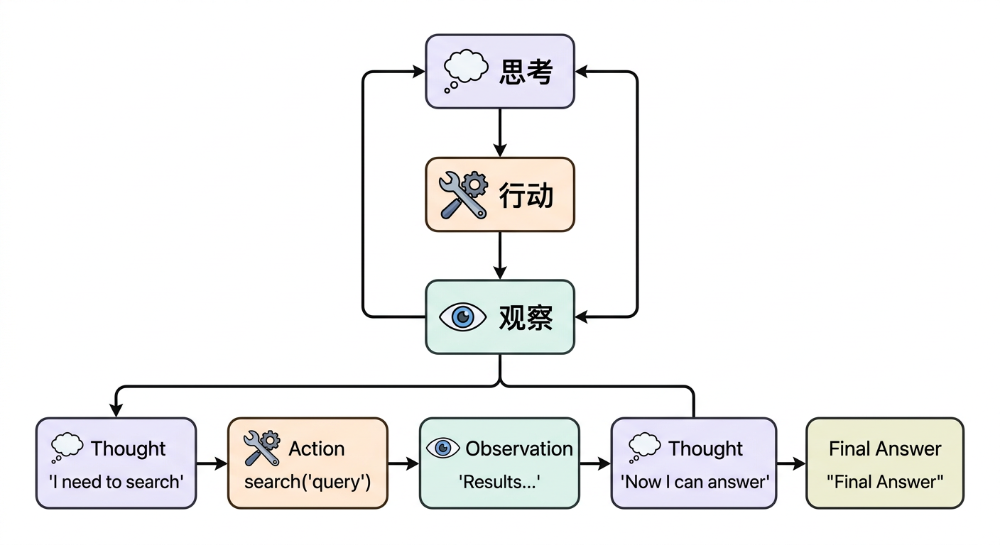

# 第九章：RAG与Agent应用

## 学习目标

完成本章学习后，你将能够：
- 理解RAG系统的架构和工作原理
- 掌握向量数据库和Embedding技术
- 理解Agent框架和Function Calling机制
- 熟悉实际应用中的RAG和Agent设计模式

---

## 9.1 RAG概述

### 什么是RAG？



### RAG vs Fine-tuning

| 特性 | RAG | Fine-tuning |
|-----|-----|-------------|
| 知识更新 | 实时更新知识库 | 需要重新训练 |
| 成本 | 低，无需训练 | 高，需要GPU训练 |
| 可解释性 | 高，可追溯来源 | 低，知识隐含在参数 |
| 幻觉 | 减少（有出处） | 可能增加 |
| 适用场景 | 知识密集、实时更新 | 风格、行为调整 |

### RAG的优势

```
1. 知识实时性
   - 知识库随时更新
   - 无需重新训练模型

2. 减少幻觉
   - 答案有据可查
   - 可以引用来源

3. 成本效益
   - 不需要训练大模型
   - 可以用较小的模型

4. 可解释性
   - 知道答案来自哪些文档
   - 便于审计和纠错
```

---

## 9.2 RAG系统架构

### 基础RAG流程

```
┌───────────────────────────────────────────────────────────┐
│                    RAG完整流程                             │
│                                                           │
│  离线索引阶段：                                            │
│  ┌─────────┐   ┌─────────┐   ┌─────────┐   ┌─────────┐  │
│  │ 文档加载 │→  │ 文档切分 │→  │ 向量化   │→  │ 存储索引 │  │
│  └─────────┘   └─────────┘   └─────────┘   └─────────┘  │
│                                                           │
│  在线查询阶段：                                            │
│  ┌─────────┐   ┌─────────┐   ┌─────────┐   ┌─────────┐  │
│  │ 用户问题 │→  │ 问题向量化│→ │ 相似检索 │→  │ 重排序   │  │
│  └─────────┘   └─────────┘   └─────────┘   └─────────┘  │
│                              │                           │
│                              ↓                           │
│  ┌─────────┐   ┌─────────────────────────┐              │
│  │ 生成答案 │←  │ Prompt = 问题 + 检索结果 │              │
│  └─────────┘   └─────────────────────────┘              │
│                                                           │
└───────────────────────────────────────────────────────────┘
```

### 关键组件

| 组件 | 功能 | 常用工具 |
|-----|------|---------|
| 文档加载器 | 读取各种格式文档 | LangChain Loaders |
| 文本切分器 | 将长文档切成chunks | RecursiveCharacterTextSplitter |
| Embedding模型 | 文本向量化 | OpenAI, BGE, E5 |
| 向量数据库 | 存储和检索向量 | Chroma, Pinecone, Milvus |
| 检索器 | 相似性搜索 | Dense/Sparse/Hybrid |
| 重排序器 | 精排检索结果 | Cohere, BGE-reranker |
| 生成模型 | 生成最终答案 | GPT-4, Claude, LLaMA |

---

## 9.3 文档处理与切分

### 文档切分策略

```python
from langchain.text_splitter import RecursiveCharacterTextSplitter

# 递归字符切分（推荐）
splitter = RecursiveCharacterTextSplitter(
    chunk_size=500,           # 每个chunk的大小
    chunk_overlap=50,         # 相邻chunk的重叠
    separators=["\n\n", "\n", "。", "！", "？", " "],  # 分隔符优先级
)

chunks = splitter.split_documents(documents)
```

### 切分参数选择

| 参数 | 小值 | 大值 | 建议 |
|-----|------|------|------|
| chunk_size | 精确但上下文少 | 上下文多但噪声大 | 500-1000 |
| chunk_overlap | 信息可能断裂 | 冗余增加 | 10-20%的chunk_size |

### 特殊文档处理

```
┌───────────────────────────────────────────────────────────┐
│                   文档类型处理                             │
│                                                           │
│  PDF：                                                    │
│  - pypdf, pdfplumber                                     │
│  - 注意表格和图片处理                                      │
│                                                           │
│  Markdown：                                               │
│  - 按标题分层切分                                         │
│  - 保留元数据（标题层级）                                  │
│                                                           │
│  代码：                                                    │
│  - 按函数/类切分                                          │
│  - 保留完整代码块                                         │
│                                                           │
│  表格数据：                                                │
│  - 转为结构化描述                                         │
│  - 或保持表格格式                                         │
│                                                           │
└───────────────────────────────────────────────────────────┘
```

---

## 9.4 Embedding技术

### Embedding原理

```
将文本映射到高维向量空间
语义相似的文本，向量距离近

"今天天气很好" → [0.1, 0.3, -0.2, ...]  (768维)
"今天天气不错" → [0.1, 0.3, -0.2, ...]  (相似向量)
"我喜欢吃苹果" → [-0.5, 0.1, 0.8, ...]  (不同向量)
```

### 主流Embedding模型

| 模型 | 维度 | 特点 | 场景 |
|-----|------|------|------|
| OpenAI text-embedding-3-small | 1536 | 商业API，简单易用 | 通用 |
| OpenAI text-embedding-3-large | 3072 | 更高精度 | 高要求 |
| BGE-M3 | 1024 | 开源，多语言 | 中文友好 |
| E5-large | 1024 | 开源，效果好 | 通用 |
| GTE-large | 1024 | 阿里开源 | 中文 |

### Embedding使用

```python
from sentence_transformers import SentenceTransformer

# 加载模型
model = SentenceTransformer('BAAI/bge-large-zh-v1.5')

# 编码文本
texts = ["今天天气很好", "明天会下雨"]
embeddings = model.encode(texts)

# 计算相似度
from sklearn.metrics.pairwise import cosine_similarity
similarity = cosine_similarity([embeddings[0]], [embeddings[1]])
```

### Query和Document的Embedding

```
┌───────────────────────────────────────────────────────────┐
│              Query vs Document Embedding                  │
│                                                           │
│  对称模型：                                                │
│  - Query和Document用同一种方式编码                         │
│  - 适合语义相似度                                         │
│                                                           │
│  非对称模型：                                              │
│  - Query加instruction前缀                                 │
│  - Document加不同前缀                                     │
│  - 更适合检索场景                                         │
│                                                           │
│  BGE示例：                                                │
│  Query: "为这个句子生成表示以检索相关文章：什么是机器学习？" │
│  Document: "机器学习是人工智能的一个分支..."               │
│                                                           │
└───────────────────────────────────────────────────────────┘
```

---

## 9.5 向量数据库

### 主流向量数据库

| 数据库 | 类型 | 特点 | 适用场景 |
|-------|------|------|---------|
| Chroma | 嵌入式 | 简单易用 | 开发测试 |
| FAISS | 库 | Facebook开源，高性能 | 本地大规模 |
| Pinecone | 云服务 | 全托管，易扩展 | 生产环境 |
| Milvus | 分布式 | 开源，功能全 | 大规模生产 |
| Weaviate | 分布式 | GraphQL接口 | 复杂查询 |
| Qdrant | 分布式 | Rust实现，高性能 | 生产环境 |

### Chroma使用示例

```python
import chromadb
from chromadb.utils import embedding_functions

# 创建客户端
client = chromadb.Client()

# 使用embedding函数
ef = embedding_functions.SentenceTransformerEmbeddingFunction(
    model_name="BAAI/bge-large-zh-v1.5"
)

# 创建collection
collection = client.create_collection(
    name="my_docs",
    embedding_function=ef
)

# 添加文档
collection.add(
    documents=["文档1内容", "文档2内容"],
    metadatas=[{"source": "doc1"}, {"source": "doc2"}],
    ids=["id1", "id2"]
)

# 查询
results = collection.query(
    query_texts=["查询问题"],
    n_results=5
)
```

### 检索策略

```
┌───────────────────────────────────────────────────────────┐
│                     检索策略                              │
│                                                           │
│  Dense Retrieval（密集检索）：                             │
│  - 基于向量相似度                                         │
│  - 捕获语义相似性                                         │
│  - 可能忽略关键词                                         │
│                                                           │
│  Sparse Retrieval（稀疏检索）：                            │
│  - BM25等传统方法                                         │
│  - 基于关键词匹配                                         │
│  - 精确匹配能力强                                         │
│                                                           │
│  Hybrid Retrieval（混合检索）：                            │
│  - 结合Dense和Sparse                                     │
│  - 兼顾语义和关键词                                       │
│  - 通常效果最好                                           │
│                                                           │
│  score = α × dense_score + (1-α) × sparse_score          │
│                                                           │
└───────────────────────────────────────────────────────────┘
```

---

## 9.6 高级RAG技术

### Query改写

```python
# 问题改写增强检索
def rewrite_query(query, llm):
    prompt = f"""
    将以下问题改写成3个不同的表述，以便更好地检索相关文档：

    原问题：{query}

    改写：
    """
    rewritten = llm(prompt)
    return rewritten.split('\n')

# 使用多个改写的query检索，合并结果
```

### HyDE（假设性文档嵌入）

```
┌───────────────────────────────────────────────────────────┐
│                        HyDE                               │
│                                                           │
│  核心思想：                                                │
│  用LLM生成假设性答案，用答案的向量去检索                    │
│                                                           │
│  流程：                                                    │
│  1. 用户问题 → LLM生成假设性答案（可能不准确）             │
│  2. 假设性答案 → Embedding → 向量                         │
│  3. 用这个向量检索 → 找到真正相关的文档                    │
│  4. 文档 + 问题 → LLM生成最终答案                         │
│                                                           │
│  好处：                                                    │
│  - 问题和文档的向量空间可能不一致                          │
│  - 假设答案和真实文档更相似                                │
│                                                           │
└───────────────────────────────────────────────────────────┘
```

### 重排序（Reranking）

```python
from sentence_transformers import CrossEncoder

# 使用Cross-Encoder重排序
reranker = CrossEncoder('BAAI/bge-reranker-large')

def rerank(query, documents, top_k=3):
    # 计算query和每个document的相关性分数
    pairs = [[query, doc] for doc in documents]
    scores = reranker.predict(pairs)

    # 按分数排序
    ranked = sorted(zip(documents, scores),
                   key=lambda x: x[1], reverse=True)
    return [doc for doc, score in ranked[:top_k]]
```

### 多步检索

```
复杂问题可能需要多步检索

示例问题："比较GPT-4和Claude在数学推理上的表现"

Step 1: 检索"GPT-4数学推理能力"
Step 2: 检索"Claude数学推理能力"
Step 3: 综合两步结果回答
```

---

## 9.7 Agent概述

### 什么是Agent？



### Agent vs RAG

| 特性 | RAG | Agent |
|-----|-----|-------|
| 能力范围 | 检索+生成 | 推理+行动 |
| 工具数量 | 1个（检索） | 多个工具 |
| 交互方式 | 单轮 | 多轮迭代 |
| 自主性 | 低 | 高 |
| 复杂度 | 低 | 高 |

---

## 9.8 Function Calling

### Function Calling原理

```
┌───────────────────────────────────────────────────────────┐
│                   Function Calling                        │
│                                                           │
│  让LLM决定调用哪个函数，以及传入什么参数                    │
│                                                           │
│  流程：                                                    │
│  1. 用户输入 + 可用函数定义 → LLM                         │
│  2. LLM决定是否调用函数，输出函数名和参数                   │
│  3. 应用程序执行函数，获取结果                              │
│  4. 函数结果 → LLM → 生成最终回答                         │
│                                                           │
└───────────────────────────────────────────────────────────┘
```

### OpenAI Function Calling示例

```python
import openai

# 定义函数
tools = [
    {
        "type": "function",
        "function": {
            "name": "get_weather",
            "description": "获取指定城市的天气信息",
            "parameters": {
                "type": "object",
                "properties": {
                    "city": {
                        "type": "string",
                        "description": "城市名称"
                    }
                },
                "required": ["city"]
            }
        }
    }
]

# 调用
response = openai.chat.completions.create(
    model="gpt-4",
    messages=[{"role": "user", "content": "北京今天天气怎么样？"}],
    tools=tools,
    tool_choice="auto"
)

# 处理函数调用
if response.choices[0].message.tool_calls:
    tool_call = response.choices[0].message.tool_calls[0]
    function_name = tool_call.function.name
    arguments = json.loads(tool_call.function.arguments)

    # 执行函数
    result = get_weather(arguments["city"])

    # 将结果返回给LLM
    messages.append(response.choices[0].message)
    messages.append({
        "role": "tool",
        "tool_call_id": tool_call.id,
        "content": result
    })

    # 获取最终回答
    final_response = openai.chat.completions.create(
        model="gpt-4",
        messages=messages
    )
```

---

## 9.9 Agent框架

### ReAct模式



### LangChain Agent实现

```python
from langchain.agents import create_react_agent, AgentExecutor
from langchain.tools import Tool
from langchain_openai import ChatOpenAI

# 定义工具
tools = [
    Tool(
        name="Search",
        func=search_function,
        description="用于搜索信息"
    ),
    Tool(
        name="Calculator",
        func=calculator_function,
        description="用于数学计算"
    )
]

# 创建Agent
llm = ChatOpenAI(model="gpt-4")
agent = create_react_agent(llm, tools, prompt_template)
agent_executor = AgentExecutor(agent=agent, tools=tools, verbose=True)

# 运行
result = agent_executor.invoke({"input": "用户问题"})
```

### 多Agent协作

```
┌───────────────────────────────────────────────────────────┐
│                   Multi-Agent系统                         │
│                                                           │
│  规划Agent                                                │
│      │                                                    │
│      ↓ 分解任务                                           │
│  ┌───┴───┐                                               │
│  ↓       ↓                                               │
│ 研究Agent  编码Agent                                      │
│  │        │                                              │
│  ↓        ↓                                              │
│ 搜索工具  代码执行工具                                     │
│  │        │                                              │
│  └───┬────┘                                              │
│      ↓                                                    │
│  汇总Agent → 最终结果                                     │
│                                                           │
└───────────────────────────────────────────────────────────┘
```

---

## 9.10 实战案例

### RAG系统完整实现

```python
from langchain_community.document_loaders import PyPDFLoader
from langchain.text_splitter import RecursiveCharacterTextSplitter
from langchain_community.vectorstores import Chroma
from langchain_openai import OpenAIEmbeddings, ChatOpenAI
from langchain.chains import RetrievalQA

class RAGSystem:
    def __init__(self):
        self.embeddings = OpenAIEmbeddings()
        self.llm = ChatOpenAI(model="gpt-4")
        self.vectorstore = None

    def index_documents(self, pdf_paths):
        # 1. 加载文档
        documents = []
        for path in pdf_paths:
            loader = PyPDFLoader(path)
            documents.extend(loader.load())

        # 2. 切分
        splitter = RecursiveCharacterTextSplitter(
            chunk_size=500,
            chunk_overlap=50
        )
        chunks = splitter.split_documents(documents)

        # 3. 存储到向量数据库
        self.vectorstore = Chroma.from_documents(
            chunks,
            self.embeddings,
            persist_directory="./chroma_db"
        )

    def query(self, question):
        # 4. 创建检索链
        qa_chain = RetrievalQA.from_chain_type(
            llm=self.llm,
            chain_type="stuff",
            retriever=self.vectorstore.as_retriever(
                search_kwargs={"k": 3}
            ),
            return_source_documents=True
        )

        # 5. 查询
        result = qa_chain({"query": question})
        return {
            "answer": result["result"],
            "sources": result["source_documents"]
        }
```

### 智能客服Agent

```python
from langchain.agents import AgentExecutor, create_openai_tools_agent
from langchain_openai import ChatOpenAI
from langchain.tools import Tool

class CustomerServiceAgent:
    def __init__(self):
        self.llm = ChatOpenAI(model="gpt-4")
        self.tools = self._create_tools()

    def _create_tools(self):
        return [
            Tool(
                name="QueryOrderStatus",
                func=self._query_order,
                description="查询订单状态，输入订单号"
            ),
            Tool(
                name="SearchFAQ",
                func=self._search_faq,
                description="搜索常见问题答案"
            ),
            Tool(
                name="CreateTicket",
                func=self._create_ticket,
                description="创建人工客服工单"
            )
        ]

    def _query_order(self, order_id):
        # 查询订单数据库
        return f"订单{order_id}状态：已发货"

    def _search_faq(self, query):
        # RAG检索FAQ
        return "相关FAQ答案..."

    def _create_ticket(self, issue):
        # 创建工单
        return "工单已创建，编号: T12345"

    def chat(self, user_input):
        agent = create_openai_tools_agent(self.llm, self.tools, prompt)
        executor = AgentExecutor(agent=agent, tools=self.tools)
        return executor.invoke({"input": user_input})
```

---

## 9.11 本章小结

### 核心要点回顾

1. **RAG架构**：检索+生成，解决知识过时和幻觉
2. **Embedding**：文本向量化，语义相似性搜索
3. **向量数据库**：高效存储和检索向量
4. **Agent**：具备推理和行动能力的智能体
5. **Function Calling**：让LLM调用外部工具

### RAG最佳实践

```
1. 文档处理
   - 合适的chunk size（500-1000）
   - 适当的overlap（10-20%）
   - 保留元数据

2. 检索优化
   - 使用混合检索
   - 添加重排序
   - Query改写增强

3. 生成优化
   - 合理的prompt设计
   - 引用来源
   - 处理无答案情况
```

---

## 延伸阅读

### 必读论文

1. **RAG**: Retrieval-Augmented Generation for Knowledge-Intensive NLP Tasks
2. **ReAct**: Synergizing Reasoning and Acting in Language Models
3. **HyDE**: Hypothetical Document Embeddings
4. **Self-RAG**: Learning to Retrieve, Generate, and Critique
5. **Toolformer**: Language Models Can Teach Themselves to Use Tools

### 推荐资源

- [LangChain Documentation](https://docs.langchain.com/)
- [LlamaIndex](https://docs.llamaindex.ai/)
- [Chroma Documentation](https://docs.trychroma.com/)

---

下一章：[第十章：前沿趋势与实战总结](../第十章_前沿趋势与实战总结/01_正文.md)
