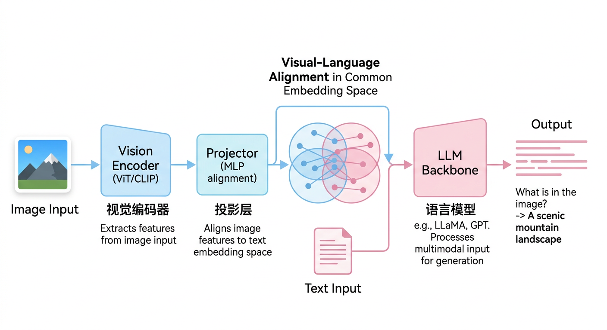
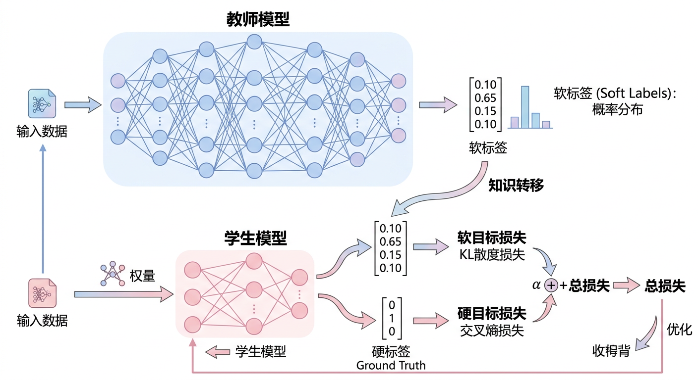
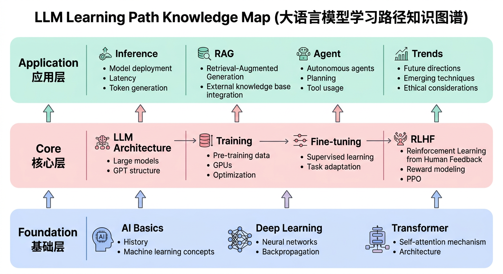

# 第十章：前沿趋势与实战总结

## 学习目标

完成本章学习后，你将能够：
- 了解大模型领域的前沿发展方向
- 掌握多模态、长上下文等关键技术
- 理解知识蒸馏和模型压缩技术
- 熟悉面试和技术答辩的策略技巧

---

## 10.1 多模态大模型

### 多模态概述

```
┌───────────────────────────────────────────────────────────┐
│                   多模态大模型                             │
│                                                           │
│  定义：能够理解和生成多种模态内容的模型                     │
│                                                           │
│  模态类型：                                                │
│  ├── 文本（Text）                                         │
│  ├── 图像（Image）                                        │
│  ├── 音频（Audio）                                        │
│  ├── 视频（Video）                                        │
│  └── 其他（代码、表格、3D等）                              │
│                                                           │
│  代表模型：                                                │
│  ├── GPT-4V/GPT-4o（OpenAI）                             │
│  ├── Gemini（Google）                                    │
│  ├── Claude 3（Anthropic）                               │
│  └── LLaVA（开源）                                        │
│                                                           │
└───────────────────────────────────────────────────────────┘
```

### 视觉-语言模型架构



### 主流多模态模型对比

| 模型 | 公司 | 视觉编码器 | LLM骨干 | 特点 |
|-----|------|----------|--------|------|
| GPT-4V | OpenAI | 未公开 | GPT-4 | 最强商业API |
| Gemini | Google | 未公开 | Gemini | 原生多模态 |
| Claude 3 | Anthropic | 未公开 | Claude 3 | 视觉理解强 |
| LLaVA | 开源 | CLIP | LLaMA | 架构清晰 |
| Qwen-VL | 阿里 | ViT | Qwen | 中文友好 |

### 多模态训练

```
训练阶段：

阶段1：视觉-语言对齐
- 使用图文对数据
- 训练Projector
- 冻结Vision Encoder和LLM

阶段2：指令微调
- 使用多模态指令数据
- 微调Projector + LLM
- 可选：微调Vision Encoder
```

---

## 10.2 长上下文技术

### 长上下文挑战

```
┌───────────────────────────────────────────────────────────┐
│                   长上下文挑战                             │
│                                                           │
│  1. 注意力复杂度                                          │
│     O(n²)计算和内存                                       │
│     128K context → 需要大量资源                           │
│                                                           │
│  2. 位置编码外推                                          │
│     训练时的位置编码无法泛化到更长序列                      │
│                                                           │
│  3. 长距离依赖                                            │
│     模型难以关注很远的信息                                 │
│                                                           │
│  4. KV Cache                                             │
│     长上下文导致显存爆炸                                   │
│                                                           │
└───────────────────────────────────────────────────────────┘
```

### 位置编码扩展

```
RoPE（Rotary Position Embedding）扩展方法：

1. Position Interpolation (PI)
   将位置缩放到训练范围内
   position = position / scale_factor

2. NTK-aware Interpolation
   在频率空间进行插值
   保持低频位置编码不变

3. YaRN
   结合PI和NTK
   分段处理不同频率

4. Code Llama的方案
   长序列上继续训练
   直接扩展位置编码范围
```

### 高效长上下文方法

| 方法 | 原理 | 代表 |
|-----|------|------|
| Sparse Attention | 只计算部分注意力 | Longformer, BigBird |
| Sliding Window | 局部注意力+全局token | Mistral |
| Linear Attention | 线性复杂度注意力 | RWKV, Mamba |
| Ring Attention | 分布式处理长序列 | Ring Attention |

### Mamba和状态空间模型

```
┌───────────────────────────────────────────────────────────┐
│                   Mamba/SSM                               │
│                                                           │
│  核心思想：用状态空间模型代替Attention                      │
│                                                           │
│  状态空间模型：                                            │
│  h(t) = Ah(t-1) + Bx(t)    状态更新                      │
│  y(t) = Ch(t)              输出                          │
│                                                           │
│  优势：                                                    │
│  - 线性复杂度 O(n)                                        │
│  - 推理恒定内存                                           │
│  - 适合长序列                                             │
│                                                           │
│  Mamba创新：                                              │
│  - 选择性状态空间（参数依赖输入）                          │
│  - 硬件优化实现                                           │
│                                                           │
└───────────────────────────────────────────────────────────┘
```

---

## 10.3 知识蒸馏

### 知识蒸馏原理



### LLM蒸馏方法

```
1. 输出蒸馏
   - 让学生模型模仿教师的输出分布
   - L = KL(P_student || P_teacher)

2. 特征蒸馏
   - 对齐中间层特征
   - 需要选择对应的层

3. 数据增强蒸馏
   - 用大模型生成训练数据
   - 小模型在生成数据上训练

4. 链式蒸馏
   - 逐步减小模型
   - 70B → 13B → 7B → 1B
```

### 代码示例

```python
import torch
import torch.nn.functional as F

def distillation_loss(student_logits, teacher_logits, labels, temperature=2.0, alpha=0.5):
    """
    知识蒸馏损失
    """
    # Soft targets (from teacher)
    soft_targets = F.softmax(teacher_logits / temperature, dim=-1)
    soft_student = F.log_softmax(student_logits / temperature, dim=-1)
    soft_loss = F.kl_div(soft_student, soft_targets, reduction='batchmean')
    soft_loss = soft_loss * (temperature ** 2)

    # Hard targets (ground truth)
    hard_loss = F.cross_entropy(student_logits, labels)

    # Combined loss
    loss = alpha * soft_loss + (1 - alpha) * hard_loss
    return loss

# 训练循环
for batch in dataloader:
    with torch.no_grad():
        teacher_logits = teacher_model(batch)
    student_logits = student_model(batch)

    loss = distillation_loss(student_logits, teacher_logits, batch.labels)
    loss.backward()
    optimizer.step()
```

---

## 10.4 模型压缩技术

### 压缩方法概览

| 方法 | 原理 | 压缩率 | 精度损失 |
|-----|------|-------|---------|
| 量化 | 降低精度 | 2-8× | 小 |
| 剪枝 | 移除参数 | 2-10× | 中 |
| 蒸馏 | 知识转移 | 任意 | 中 |
| 低秩分解 | 矩阵分解 | 2-4× | 小 |

### 剪枝技术

```
┌───────────────────────────────────────────────────────────┐
│                      剪枝类型                              │
│                                                           │
│  非结构化剪枝（Unstructured）：                            │
│  - 移除单个权重                                           │
│  - 灵活，压缩率高                                         │
│  - 需要稀疏计算支持                                        │
│                                                           │
│  结构化剪枝（Structured）：                                │
│  - 移除整个通道/层/注意力头                                │
│  - 直接减少计算量                                         │
│  - 硬件友好                                               │
│                                                           │
│  LLM剪枝策略：                                            │
│  - SparseGPT：一次性剪枝                                  │
│  - Wanda：简单有效的权重剪枝                              │
│  - LLM-Pruner：结构化剪枝                                 │
│                                                           │
└───────────────────────────────────────────────────────────┘
```

### 低秩分解

```
原理：将大矩阵分解为小矩阵的乘积

W ∈ ℝ^(m×n) ≈ U × V^T
其中 U ∈ ℝ^(m×r), V ∈ ℝ^(n×r), r << min(m,n)

参数量：m×n → m×r + n×r

应用：
- 预训练权重分解
- 与LoRA结合使用
```

---

## 10.5 最新技术趋势

### 2024-2025技术热点

```
┌───────────────────────────────────────────────────────────┐
│                   技术趋势                                 │
│                                                           │
│  1. 多模态原生模型                                        │
│     - 从训练开始就是多模态                                 │
│     - 不是后期融合                                        │
│                                                           │
│  2. 小模型能力提升                                        │
│     - 7B模型接近GPT-3.5                                   │
│     - 效率和能力平衡                                       │
│                                                           │
│  3. Agent和工具使用                                       │
│     - 更强的规划能力                                      │
│     - 更可靠的工具调用                                     │
│                                                           │
│  4. 长上下文                                              │
│     - 100K+上下文成为标配                                 │
│     - 高效处理长文档                                       │
│                                                           │
│  5. 推理加速                                              │
│     - 更低延迟                                            │
│     - 边缘部署                                            │
│                                                           │
└───────────────────────────────────────────────────────────┘
```

### 开源生态发展

| 领域 | 代表项目 | 特点 |
|-----|---------|------|
| 基础模型 | LLaMA, Mistral, Qwen | 开源权重 |
| 微调 | PEFT, LLaMA-Factory | 高效微调 |
| 推理 | vLLM, TensorRT-LLM | 高性能推理 |
| 应用 | LangChain, LlamaIndex | RAG和Agent |
| 评估 | lm-evaluation-harness | 标准化评测 |

---

## 10.6 面试与答辩技巧

### 面试准备策略

```
┌───────────────────────────────────────────────────────────┐
│                   面试准备                                 │
│                                                           │
│  1. 知识储备                                              │
│     ├── 基础原理：Transformer、Attention、训练技术        │
│     ├── 实践技能：微调、推理部署、RAG                      │
│     └── 前沿进展：最新论文和技术动态                       │
│                                                           │
│  2. 项目经验                                              │
│     ├── 准备2-3个深度项目                                 │
│     ├── 能说清楚技术选型原因                               │
│     └── 遇到的问题和解决方案                               │
│                                                           │
│  3. 代码能力                                              │
│     ├── 能手写Attention、LoRA核心代码                     │
│     ├── 熟悉PyTorch和HuggingFace                         │
│     └── 能快速实现简单功能                                 │
│                                                           │
└───────────────────────────────────────────────────────────┘
```

### 常见面试问题分类

| 类别 | 示例问题 | 考察点 |
|-----|---------|-------|
| 基础原理 | 解释Transformer | 理解深度 |
| 技术细节 | LoRA原理 | 实践经验 |
| 方案设计 | 设计RAG系统 | 系统思维 |
| 问题解决 | Loss不下降怎么办 | 实战能力 |
| 前沿了解 | 最近关注什么论文 | 学习能力 |

### 回答技巧

```
STAR法则：
- Situation：描述背景
- Task：说明任务
- Action：采取的行动
- Result：取得的结果

示例：
"在之前的项目中（S），我们需要部署一个7B模型到单卡服务器（T）。
我采用了AWQ量化将模型压缩到4-bit，并使用vLLM部署（A）。
最终将显存需求从14GB降到4GB，QPS提升了3倍（R）。"
```

### 技术答辩要点

```
1. 清晰的问题定义
   - 为什么要做这个
   - 解决什么问题

2. 技术选型论证
   - 对比了哪些方案
   - 为什么选择当前方案

3. 实现细节
   - 关键技术点
   - 遇到的挑战

4. 效果评估
   - 量化指标
   - 与基线对比

5. 总结和展望
   - 主要贡献
   - 未来改进方向
```

---

## 10.7 知识体系总结

### 全书知识图谱



### 核心概念关系

```
预训练
   │
   ↓ 通用语言能力
SFT/指令微调
   │
   ↓ 指令遵循能力
RLHF/DPO
   │
   ↓ 对齐人类偏好
部署应用
   │
   ├── 量化压缩 → 降低成本
   ├── RAG → 知识增强
   └── Agent → 工具使用
```

### 技术选型速查

| 场景 | 推荐方案 |
|-----|---------|
| 微调资源有限 | QLoRA |
| 快速原型 | LoRA + HuggingFace |
| 对齐训练 | DPO（简单）或PPO（效果） |
| 推理部署 | vLLM + AWQ量化 |
| 知识增强 | RAG + 混合检索 |
| 工具使用 | Function Calling + ReAct |

---

## 10.8 本章小结

### 核心要点回顾

1. **多模态**：VLM架构、视觉语言对齐
2. **长上下文**：位置编码扩展、高效注意力
3. **知识蒸馏**：教师-学生框架、多种蒸馏方法
4. **模型压缩**：量化、剪枝、蒸馏、分解
5. **面试技巧**：知识储备、项目经验、表达能力

### 学习建议

```
1. 打好基础
   - 深入理解Transformer
   - 熟悉PyTorch和HuggingFace

2. 动手实践
   - 跑通完整的微调流程
   - 搭建一个RAG系统
   - 部署一个推理服务

3. 持续学习
   - 关注最新论文和开源项目
   - 参与社区讨论
   - 记录学习笔记

4. 准备面试
   - 整理项目经验
   - 练习技术表达
   - 模拟面试
```

---

## 延伸阅读

### 必读论文

1. **LLaVA**: Visual Instruction Tuning
2. **Mamba**: Linear-Time Sequence Modeling with Selective State Spaces
3. **Mistral**: Sliding Window Attention
4. **DistilBERT**: A distilled version of BERT
5. **SparseGPT**: Massive Language Models Can Be Accurately Pruned

### 推荐资源

- [Hugging Face Course](https://huggingface.co/learn)
- [LLM Course](https://github.com/mlabonne/llm-course)
- [Awesome LLM](https://github.com/Hannibal046/Awesome-LLM)
- [Papers With Code - LLM](https://paperswithcode.com/methods/category/language-models)

### 持续学习

```
论文追踪：
- arXiv每日更新
- Papers With Code
- Twitter/X上的研究者

社区参与：
- Hugging Face Discord
- Reddit r/MachineLearning
- 知乎、CSDN技术社区

开源贡献：
- 为开源项目提PR
- 分享学习笔记
- 复现论文代码
```

---

## 结语

恭喜你完成了全部十章的学习！

从AI基础到Transformer架构，从预训练到微调对齐，从推理部署到RAG应用，你已经建立了系统的大模型知识体系。

记住：
- **理论是基础**：深入理解原理才能灵活应用
- **实践是关键**：动手做项目才能真正掌握
- **持续学习**：AI领域发展迅速，保持学习热情

祝你在面试和技术答辩中取得优异成绩！

---

返回首页：[README.md](../README.md)
